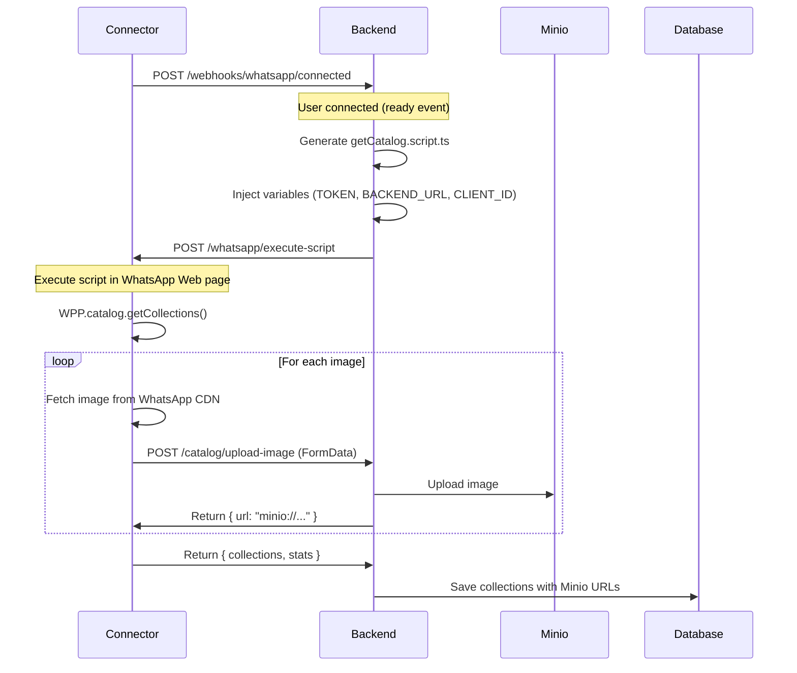
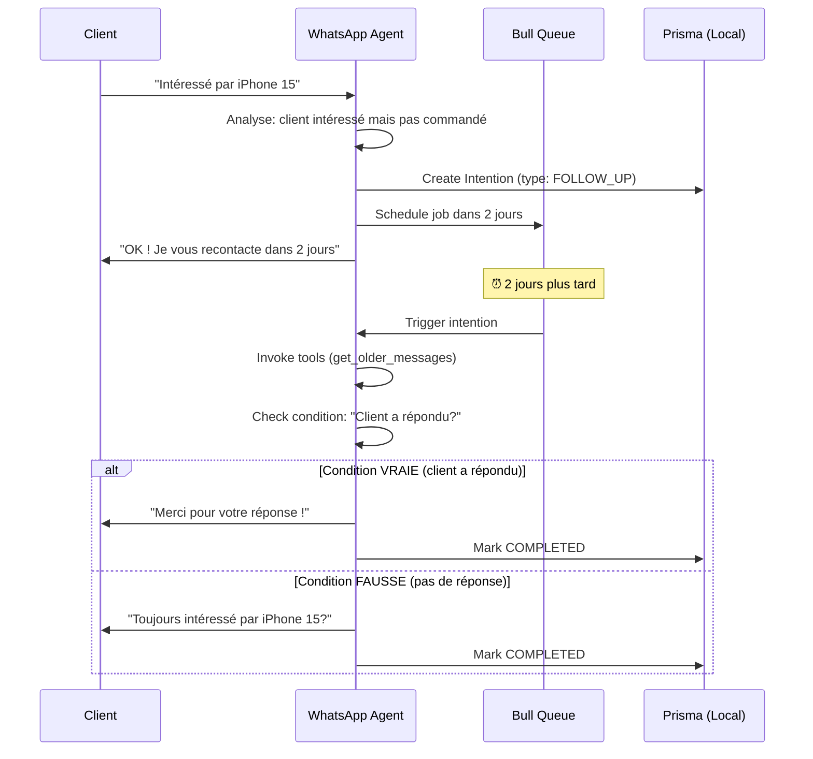

# Architecture Découplée Connector ↔ Backend

## 🎯 Objectif

Séparer les responsabilités entre le **WhatsApp Connector** (client pur) et le **Backend**
(orchestrateur) pour :

- ✅ Minimiser les redéploiements du connector (sensible car connecté à WhatsApp)
- ✅ Centraliser la logique métier dans le backend
- ✅ Permettre l'évolution des fonctionnalités sans toucher au connector

---

## 📐 Architecture

### **Connector** (whatsapp-connector)

**Rôle** : Client pur WhatsApp Web

#### Responsabilités :

- Se connecter à WhatsApp Web via `whatsapp-web.js`
- Envoyer des événements via webhooks (`ready`, `qr`, `message`, etc.)
- Exposer un endpoint pour **exécuter du code** dans la page WhatsApp Web
- ❌ **NE FAIT PLUS** : Logique métier, téléchargement/upload d'images, traitement de données

### **WhatsApp Agent** (whatsapp-agent)

**Rôle** : Agent IA décentralisé pour le business quotidien

#### Responsabilités :

- **IA & LangChain** : Traitement intelligent des messages avec tools
- **Intentions** : Gestion des rappels intelligents (relances, suivis)
- **Mémoires** : Stockage local des préférences et contexte client
- **Catalogue local** : Cache avec embeddings pour recherche sémantique
- **Queue** : Traitement asynchrone des intentions programmées

#### Base de données locale :

- `ConversationMemory` : Mémoires persistantes des clients
- `Intention` : Intentions programmées avec conditions
- `ScheduledMessage` : Messages programmés (queue)
- `CatalogProduct` : Catalogue local avec embeddings

#### Communication avec Backend :

- ✅ `POST /agent/can-process` : Vérifier si traiter un message
- ✅ `POST /agent/log-operation` : Logger les métriques (tokens, tools, durée)
- ❌ **NE FAIT PAS** : Onboarding, facturation, configuration globale

#### Endpoints exposés :

```
POST /whatsapp/execute-script
Body: { script: string }
```

Exécute du JavaScript dans le contexte de la page WhatsApp Web (accès à `window.WPP`).

#### Configuration :

```env
CONNECTOR_SECRET=your-secret      # Pour signer les webhooks
WEBHOOK_URLS=http://backend/...   # URLs à notifier
```

---

### **Backend** (apps/backend)

**Rôle** : Orchestrateur centralisé - Onboarding, Facturation, Configuration

#### Responsabilités :

- **Onboarding** : Gestion du processus d'inscription des clients
- **Facturation** : Tracking des crédits, abonnements, paiements
- **Configuration** : WhatsAppAgent, groupes autorisés, contexte métier
- **Logs & Analytics** : Stockage des AgentOperation (tokens, durée, tools)
- **Orchestration Connector** : Génération et envoi de scripts au connector
- **Stockage centralisé** : Minio pour images/avatars, BD pour config globale

#### Ce que le Backend NE FAIT PAS :

- ❌ Traitement IA des messages (délégué à WhatsApp-Agent)
- ❌ Gestion des intentions et rappels (délégué à WhatsApp-Agent)
- ❌ Cache catalogue avec embeddings (délégué à WhatsApp-Agent)
- ❌ Mémoires conversationnelles (délégué à WhatsApp-Agent)

#### Workflow - Récupération du catalogue



---

## 🗂️ Structure des fichiers

### Backend

```
apps/backend/src/
├── page-scripts/                    # Scripts exécutés dans la page WhatsApp
│   ├── getCatalog.script.ts        # Script de récupération du catalogue
│   ├── page-script.service.ts      # Service de templating ({{VAR}})
│   └── page-script.module.ts
│
├── catalog/                         # Module catalogue
│   ├── catalog.controller.ts       # POST /catalog/upload-image
│   ├── catalog.service.ts          # Logique de gestion des images
│   └── catalog.module.ts
│
├── minio/                           # Module Minio (S3)
│   ├── minio.service.ts            # Upload/download vers Minio
│   └── minio.module.ts
│
├── webhooks/                        # Webhooks du connector
│   ├── webhooks.controller.ts      # Reçoit les événements
│   └── webhooks.module.ts
│
└── connector-client/                # Client HTTP vers connector
    └── connector-client.service.ts # executeScript()
```

### Connector

```
apps/whatsapp-connector/src/
├── whatsapp/
│   ├── whatsapp-client.service.ts  # Client WhatsApp (allégé)
│   ├── whatsapp.controller.ts      # POST /execute-script
│   └── webhook.service.ts          # Envoie webhooks avec signature
│
└── catalog/                         # ❌ MODULE SUPPRIMÉ
```

---

## 🔧 Configuration

### Backend (.env)

```env
# Connector
WHATSAPP_CONNECTOR_BASE_URL=http://localhost:3001
CONNECTOR_SECRET=your-shared-secret

# Minio
MINIO_ENDPOINT=files-example.com
MINIO_PORT=443
MINIO_USE_SSL=true
MINIO_ACCESS_KEY=your-key
MINIO_SECRET_KEY=your-secret
MINIO_BUCKET=whatsapp-agent
```

### Connector (.env)

```env
# Webhooks
WEBHOOK_URLS=http://backend:3000/webhooks/whatsapp/connected

# Security
CONNECTOR_SECRET=your-shared-secret   # Même que backend
```

---

## 🔐 Sécurité

### Signature des webhooks

Le connector signe tous les webhooks avec HMAC-SHA256 :

**Connector** :

```typescript
const signature = crypto
  .createHmac('sha256', CONNECTOR_SECRET)
  .update(JSON.stringify(payload))
  .digest('hex')

headers['X-Connector-Signature'] = signature
```

**Backend** :

```typescript
@UseGuards(ConnectorSignatureGuard)  // Vérifie la signature
async whatsappConnected(@Body() data) { ... }
```

---

## 📝 Scripts de page

### Exemple : getCatalog.script.ts

```javascript
// Exécuté dans le contexte de la page WhatsApp Web
const collections = await window.WPP.catalog.getCollections(userId, 50, 100)

for (const product of products) {
  const blob = await fetch(imageUrl).then(r => r.blob())

  const formData = new FormData()
  formData.append('image', blob)
  formData.append('productId', product.id)

  // Upload vers backend
  await fetch('{{BACKEND_URL}}/catalog/upload-image', {
    method: 'POST',
    headers: { Authorization: 'Bearer {{TOKEN}}' },
    body: formData,
  })
}
```

### Placeholders disponibles :

- `{{BACKEND_URL}}` : URL du backend
- `{{TOKEN}}` : Token d'authentification
- `{{CLIENT_ID}}` : ID du client WhatsApp

---

## 🚀 Déploiement

### Avantages de cette architecture :

1. **Connector stable** : Pas besoin de le redéployer souvent
2. **Backend flexible** : Modifications de logique sans toucher au connector
3. **Scalabilité** : Un connector peut servir plusieurs backends
4. **Maintenabilité** : Séparation claire des responsabilités

### Workflow de déploiement :

**Pour une nouvelle fonctionnalité** :

1. ✅ Créer un nouveau script dans `apps/backend/src/page-scripts/`
2. ✅ Ajouter l'endpoint de traitement dans le backend
3. ✅ Déclencher le script depuis un webhook
4. ❌ **Pas besoin** de toucher au connector

**Le connector ne change que si** :

- Mise à jour de `whatsapp-web.js`
- Nouveau type d'événement à écouter
- Problème de stabilité/reconnexion

---

## 🏗️ Séparation des Responsabilités

### Backend (Centralisé) vs WhatsApp-Agent (Décentralisé)

| Fonctionnalité | Backend (Centralisé) | WhatsApp-Agent (Décentralisé) |
|---|---|---|
| **Onboarding** | ✅ Gestion complète | ❌ |
| **Facturation** | ✅ Crédits, abonnements | ❌ |
| **Configuration Agent** | ✅ Contexte métier, groupes | ❌ |
| **Logs & Analytics** | ✅ Stockage AgentOperation | ✅ Envoi des métriques |
| **IA & Messages** | ❌ | ✅ LangChain + Tools |
| **Intentions** | ❌ | ✅ Gestion locale |
| **Mémoires** | ❌ | ✅ Stockage local |
| **Catalogue** | ✅ Source de vérité | ✅ Cache + embeddings |

### Pourquoi cette architecture ?

1. **Scalabilité** :
   - 1 VPS = 1 client → Charge distribuée
   - Backend léger → Gère des milliers de clients

2. **Performance** :
   - Agent local → Réponses instantanées
   - Pas de latence réseau pour chaque message

3. **Isolation** :
   - Crash d'un agent → N'affecte pas les autres
   - Données business isolées par VPS

4. **Coûts** :
   - Agent utilise ses propres ressources (API keys)
   - Backend ne paie que pour la config/logs

---

## 📊 Monitoring

### Logs à surveiller

**Connector** :

```
✅ WhatsApp client is ready!
🔍 Executing page script in browser context
```

**Backend** :

```
🚀 Executing catalog script for client: 237697020290@c.us
✅ Image uploadée: 25095720553426064-0 (main)
📦 Catalogue reçu: 2 collections, 15 produits, 45 images
```

---

## 🧠 Système d'Intentions (WhatsApp Agent)

### Principe

L'agent peut créer des **intentions** programmées qui vérifient une condition avant d'agir.

**Exemple** : "Relancer le client dans 2 jours **SI** il n'a pas répondu"

### Flow complet



### Modèle de données

```typescript
model Intention {
  id        String          @id
  chatId    String
  type      IntentionType   // FOLLOW_UP, ORDER_REMINDER, etc.
  status    IntentionStatus // PENDING → TRIGGERED → COMPLETED

  // Logique
  reason              String @db.Text  // Pourquoi cette intention
  conditionToCheck    String @db.Text  // Condition à vérifier
  actionIfTrue        String? @db.Text // Action si vraie
  actionIfFalse       String @db.Text  // Action si fausse

  // Timing
  scheduledFor        DateTime

  // Metadata
  metadata            Json?
  createdByRole       String?  // "agent" ou "admin"
}
```

### Tools disponibles

#### 1. `schedule_intention`

```typescript
{
  chatId: "237xxx@c.us",
  scheduledFor: "2025-11-29T10:00:00Z",
  type: "FOLLOW_UP",
  reason: "Client intéressé par iPhone 15 Pro",
  conditionToCheck: "Client a répondu au message",
  actionIfTrue: "Remercier le client",
  actionIfFalse: "Envoyer rappel avec lien produit",
  metadata: JSON.stringify({ productId: "iphone-15-pro" })
}
```

#### 2. `cancel_intention`

```typescript
{
  intentionId: "clx123456"
}
```

**Permissions** :
- ✅ Agent peut annuler ses propres intentions
- ✅ Admin (dans groupe) peut annuler toutes les intentions
- ❌ Agent ne peut PAS annuler les intentions créées par admin

#### 3. `list_intentions`

```typescript
{
  chatId: "237xxx@c.us"
}
```

Retourne toutes les intentions PENDING pour ce client.

### Exemple concret

**Conversation :**

```
Client: "Je suis intéressé par votre iPhone 15 Pro"
Agent: "Excellent choix ! Il coûte 1200€. Voulez-vous le commander?"
Client: "Je vais réfléchir"
Agent: [Crée intention FOLLOW_UP dans 2 jours]
       "Pas de problème ! Je vous recontacte dans 2 jours 😊"
```

**2 jours plus tard :**

```
Processor: [Déclenche l'intention]
           [Appelle l'agent avec contexte spécial]

Agent: [Use get_older_messages pour voir l'historique]
       [Vérifie: Client a répondu entre temps?]

       → SI OUI: "Merci pour votre réponse !"
       → SI NON: "Bonjour ! Toujours intéressé par l'iPhone 15 Pro? 📱"
```

### Avantages

✅ **Intelligent** - Vérifie le contexte avant d'agir
✅ **Flexible** - Agent utilise tous ses tools pour vérifier
✅ **Annulable** - Client ou admin peut annuler
✅ **Tracé** - Tous les statuts sont loggés
✅ **Décentralisé** - Chaque agent gère ses propres intentions

---

## 🎓 Cas d'usage

### Ajouter une nouvelle fonctionnalité

**Exemple** : Récupérer les messages d'un chat

1. Créer `apps/backend/src/page-scripts/getMessages.script.ts`
2. Ajouter endpoint `POST /messages/upload` dans le backend
3. Déclencher depuis un webhook ou endpoint API
4. Le connector **n'est pas modifié** ! ✅

---

## ✅ Checklist de migration

- [x] Endpoint `/execute-script` dans le connector
- [x] Module `page-scripts` dans le backend
- [x] Script `getCatalog.script.ts` avec templating
- [x] Endpoint `/catalog/upload-image` dans le backend
- [x] MinioService dans le backend
- [x] Orchestration depuis webhook `ready`
- [x] Signature HMAC-SHA256 des webhooks
- [x] Suppression de CatalogService du connector
- [x] Tests de compilation TypeScript

---

## 📚 Ressources

- WhatsApp Web.js : https://github.com/pedroslopez/whatsapp-web.js
- WPPConnect wa-js : https://wppconnect.io/wa-js/
- Minio : https://min.io/docs/minio/linux/developers/javascript/minio-javascript.html
