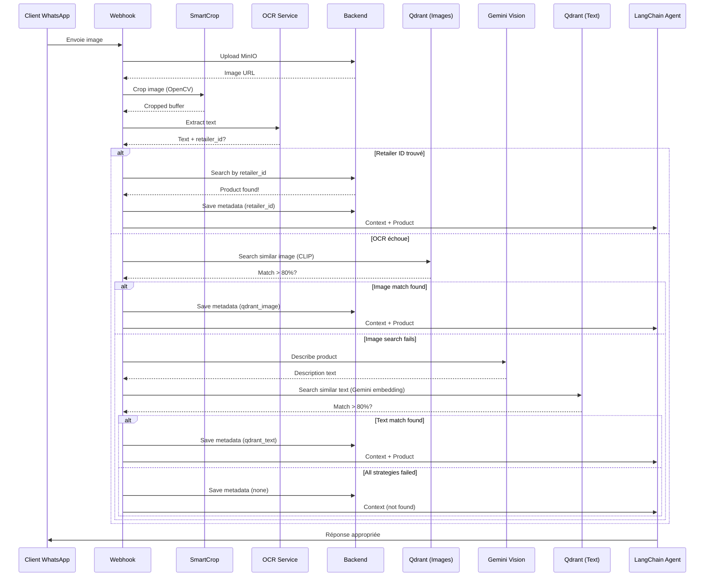

# Image Processing Strategy - WhatsApp Agent

## Vue d'ensemble

Ce document décrit la stratégie complète de traitement d'images pour l'agent WhatsApp, incluant :
1. **Synchronisation du catalogue** avec indexation Qdrant (images + texte)
2. **Traitement des images entrantes** avec identification multi-stratégie des produits
3. **Optimisation de la recherche sémantique** via Qdrant (évite les appels API inutiles)

---

## Architecture Générale

```
┌─────────────────────────────────────────────────────────────────┐
│                     CATALOG SYNC PIPELINE                        │
├─────────────────────────────────────────────────────────────────┤
│                                                                   │
│  Frontend Click "Synchroniser"                                   │
│         ↓                                                         │
│  Backend: POST /catalog/force-sync                               │
│         ↓                                                         │
│  ┌──────────────────────────────────────┐                       │
│  │ 1. Sync Products from Connector      │                       │
│  │    → Update Backend DB               │                       │
│  │    → Upload images to MinIO          │                       │
│  └──────────────────────────────────────┘                       │
│         ↓                                                         │
│  ┌──────────────────────────────────────┐                       │
│  │ 2. Trigger Agent Catalog Sync        │                       │
│  │    → POST /catalog/sync (agent)      │                       │
│  │    → Generate Gemini text embeddings │                       │
│  │    → Store in CatalogProduct         │                       │
│  └──────────────────────────────────────┘                       │
│         ↓                                                         │
│  ┌──────────────────────────────────────┐                       │
│  │ 3. NEW: Qdrant Image Indexing (Job) │                       │
│  │    → Download images from MinIO      │                       │
│  │    → Generate CLIP embeddings        │                       │
│  │    → Index in collection "images"    │                       │
│  │    → Index text in collection "text" │                       │
│  │    → Update sync status              │                       │
│  └──────────────────────────────────────┘                       │
│                                                                   │
└─────────────────────────────────────────────────────────────────┘

┌─────────────────────────────────────────────────────────────────┐
│                 INCOMING IMAGE PROCESSING                        │
├─────────────────────────────────────────────────────────────────┤
│                                                                   │
│  Customer sends image via WhatsApp                               │
│         ↓                                                         │
│  1. Smart Crop (OpenCV - winner!)                               │
│     → POST /crop/opencv (image-cropper service)                  │
│     → Extract product area from screenshot                       │
│         ↓                                                         │
│  2. OCR Text Extraction (Tesseract)                             │
│     → Extract text from cropped image                            │
│     → Search retailer_id in text                                 │
│     → IF FOUND: ✓ Context = "retailer_id: XXX"                  │
│         ↓                                                         │
│  3. Qdrant Image Search (if OCR failed)                         │
│     → Generate CLIP embedding from cropped image                 │
│     → Search in "images" collection                              │
│     → IF confidence > 80%: ✓ Context = "qdrant_image: XXX"      │
│     → Gratuit et rapide (~50ms)                                  │
│         ↓                                                         │
│  4. Gemini Vision Description (if image search failed)          │
│     → Call Gemini Vision API (PROMPT CUSTOM)                     │
│     → Get product description                                     │
│     → Plus lent et coûteux (~$0.0001) - EN DERNIER               │
│         ↓                                                         │
│  5. Qdrant Text Search (using Gemini description)               │
│     → Generate Gemini text embedding from description            │
│     → Search in "text" collection                                │
│     → IF confidence > 80%: ✓ Context = "qdrant_text: XXX"       │
│         ↓                                                         │
│  6. Fallback                                                     │
│     → Context = "Image reçue mais impossible à déterminer"       │
│         ↓                                                         │
│  7. Save to MessageMetadata + Pass to LangChain                  │
│                                                                   │
└─────────────────────────────────────────────────────────────────┘
```

---

## 1. Synchronisation du Catalogue avec Qdrant

### 1.1 Nouvelles Propriétés Database

#### Backend: `WhatsAppAgent` table

```prisma
model WhatsAppAgent {
  id                   String
  userId               String?
  status               WhatsAppAgentStatus
  connectionStatus     ConnectionStatus

  // Existing
  lastCatalogSyncedAt  DateTime?

  // NEW: Image sync tracking
  syncImageStatus      SyncImageStatus @default(PENDING)
  lastImageSyncDate    DateTime?
  lastImageSyncError   String?

  // NEW: Prompt personnalisé généré par IA
  customDescriptionPrompt  String? @db.Text  // Prompt adapté au business de l'utilisateur
  promptGeneratedAt        DateTime?         // Date de génération du prompt
  promptBasedOnProductsCount Int?            // Nombre de produits analysés pour générer le prompt
}

enum SyncImageStatus {
  PENDING  // Initial state or sync scheduled
  SYNCING  // Sync in progress
  DONE     // Last sync successful
  FAILED   // Last sync failed
}
```

#### Backend: `Product` table

```prisma
model Product {
  id                    String
  whatsapp_product_id   String?
  user_id               String
  name                  String
  description           String?
  price                 Float?
  images                ProductImage[]

  // NEW: Description générée par IA de l'image de couverture
  coverImageDescription String?  // Description standardisée pour Qdrant

  // Existing fields
  metadata              ProductMetadata[]
  collection_id         String?
  retailer_id           String?
  availability          String?
  image_hashes_for_whatsapp String[]
}
```

### 1.2 Prompt Personnalisé par Business (CRITIQUE!)

**Pourquoi un prompt personnalisé?**

Chaque type de business a des besoins différents pour identifier ses produits:
- **Vêtements:** Marque, saison, couleurs, taille
- **Immobilier:** Type de pièce, mobilier, couleurs, finitions
- **Électronique:** Marque, modèle, couleur, caractéristiques
- **Alimentaire:** Type de plat, ingrédients, présentation

**Solution:** Générer un **prompt sur-mesure** lors de la **première synchronisation** en analysant le catalogue avec **Gemini Pro (thinking mode)**.

#### Génération du Prompt Custom (Une seule fois)

**Quand?** Lors de la première synchro du catalogue (quand `customDescriptionPrompt` est null)

**Comment?**
1. Analyser un échantillon de 10-20 produits représentatifs
2. Appeler **Gemini 3 Pro Preview avec Thinking Level HIGH**
3. Générer un prompt parfaitement adapté au business
4. Sauvegarder dans `WhatsAppAgent.customDescriptionPrompt`

**Implémentation avec Gemini 3 Pro Preview:**

```typescript
import { GoogleGenAI, ThinkingLevel } from '@google/genai';

const generateCustomPrompt = async (
  sampleProducts: Product[],
  categories: string[]
): Promise<string> => {
  const ai = new GoogleGenAI({
    apiKey: process.env.GEMINI_API_KEY,
  });

  const config = {
    thinkingConfig: {
      thinkingLevel: ThinkingLevel.HIGH,
    },
    systemInstruction: [
      {
        text: `Tu es un expert en création de prompts pour des systèmes de vision par ordinateur.

Ton rôle est d'analyser un catalogue de produits et de générer un prompt d'identification parfaitement adapté au type de business.

Ce prompt sera ensuite utilisé par Gemini Vision pour décrire des images de produits de manière cohérente, permettant une recherche par similarité vectorielle dans Qdrant.

OBJECTIF: Maximiser la similarité entre les descriptions d'images du même produit (>90% de confidence).`,
      },
    ],
  };

  const model = process.env.GEMINI_PRO_MODEL || 'gemini-3-pro-preview';

  const META_PROMPT = `Analyse ce catalogue de produits et génère un prompt d'identification PARFAITEMENT adapté à ce business.

CONTEXTE DU BUSINESS:
L'utilisateur possède un catalogue de produits. Voici un échantillon représentatif de ${sampleProducts.length} produits:

${sampleProducts.map((p, i) => `${i + 1}. ${p.name}${p.description ? ` - ${p.description}` : ''}`).join('\n')}

CATÉGORIES PRINCIPALES: ${categories.join(', ')}
${sampleProducts.some(p => p.retailer_id) ? 'RETAILER_IDs UTILISÉS: Oui' : ''}

TÂCHE:
Analyse ce catalogue et génère un prompt d'identification de produits PARFAITEMENT adapté à ce type de business.

Le prompt doit permettre à Gemini Vision de décrire une image de produit de manière:
1. COHÉRENTE - Même format pour tous les produits similaires
2. PRÉCISE - Détails critiques pour différencier les produits
3. CONCISE - Maximum 1-2 phrases par description
4. UTILE - Facilite la recherche par similarité vectorielle

STRUCTURE REQUISE DU PROMPT À GÉNÉRER:

[Instruction claire sur ce qu'il faut identifier]

FORMAT REQUIS: [Définir le format exact adapté au business]

EXEMPLES CONCRETS (3-5 exemples):
[Basés sur les produits réels du catalogue ci-dessus]

RÈGLES IMPORTANTES:
1. [Règle spécifique au domaine]
2. [Règle sur la cohérence]
3. [Règle sur ce qu'il faut ignorer]
4. [Règle sur la similarité]

IMPORTANT: [Message final sur l'objectif]

EXEMPLES DE VARIATIONS PAR DOMAINE:

=== VÊTEMENTS / MODE ===
FORMAT: [Type] "[Marque/Équipe si identifier]" [Saison si identifier] [Couleurs principales] [Taille si identifier]
Exemple: Maillot "FC Barcelone Domicile 2024/2025 Bleu et Grenat Taille L"
Focus: marque, type (domicile/extérieur pour sport), saison, couleurs, coupe

=== IMMOBILIER / LOCATION ===
FORMAT: [Type de pièce] avec [Mobilier principal], [Couleurs dominantes], [Type de sol], [Éléments remarquables]
Exemple: Salon avec canapé d'angle gris, murs blancs, parquet chêne clair, baie vitrée donnant sur balcon
Focus: type d'espace, mobilier/équipements, finitions, luminosité, état général

=== ÉLECTRONIQUE / HIGH-TECH ===
FORMAT: [Catégorie] "[Marque Modèle si identifier]" [Couleur] [Caractéristiques visuelles]
Exemple: Smartphone "Samsung Galaxy S24 Ultra Noir" avec stylet S-Pen, module caméra triple
Focus: marque/modèle, couleur, caractéristiques distinctives visibles

=== ALIMENTAIRE / RESTAURATION ===
FORMAT: [Type de plat] [Ingrédients principaux], [Présentation], [Accompagnements]
Exemple: Pizza quatre fromages avec roquette, pâte fine, servie sur planche en bois
Focus: type de plat, ingrédients visibles, présentation, portions

=== MEUBLES / DÉCORATION ===
FORMAT: [Type de meuble] [Matériau] [Style] [Couleur] [Dimensions approximatives si identifier]
Exemple: Canapé d'angle tissu scandinave gris clair 4 places avec méridienne gauche
Focus: type, matériaux, style, couleur, configuration

GÉNÈRE MAINTENANT le prompt optimal pour CE business spécifique.
Le prompt doit être directement utilisable par Gemini Vision (pas de préambule, juste le prompt).

IMPORTANT:
- Adapte le FORMAT aux produits réels montrés ci-dessus
- Les exemples doivent ressembler aux vrais produits du catalogue
- Utilise le vocabulaire métier approprié
- Assure la COHÉRENCE des descriptions pour maximiser la similarité vectorielle

RAPPEL: Réponds UNIQUEMENT avec le prompt final, prêt à être utilisé par Gemini Vision.`;

  const contents = [
    {
      role: 'user',
      parts: [
        {
          text: META_PROMPT,
        },
      ],
    },
  ];

  // Appel à Gemini 3 Pro Preview avec Thinking High
  const response = await ai.models.generateContentStream({
    model,
    config,
    contents,
  });

  let generatedPrompt = '';

  // Stream la réponse
  for await (const chunk of response) {
    if (chunk.text) {
      generatedPrompt += chunk.text;
    }
  }

  // Nettoyer et retourner le prompt
  return generatedPrompt.trim();
};
```

**Variables d'environnement requises:**
```bash
GEMINI_API_KEY=your-api-key

# Modèle pour génération du prompt custom (one-time, thinking high)
GEMINI_PRO_MODEL=gemini-3-pro-preview

# Modèle pour identification des produits (quotidien, moins cher)
GEMINI_VISION_MODEL=gemini-3-flash-preview

# Google Search activation (optionnel, false par défaut)
GEMINI_ENABLE_GOOGLE_SEARCH=false
```

#### Exemples de Prompts Générés

**Business A - E-commerce Vêtements:**
```
Identifie le vêtement ou l'article de mode sur l'image.

FORMAT REQUIS: [Type de vêtement] "[Marque si identifier]" [Saison/Collection si identifier] [Couleurs principales] [Caractéristiques distinctives]

EXEMPLES CONCRETS:
- T-shirt "Nike Sportswear" Bleu Marine avec logo blanc sur la poitrine
- Robe Longue Fleurie Bleu Clair à motifs floraux, manches courtes
- Chaussures de sport "Adidas" Blanc et Noir avec semelle épaisse
- Jean Slim Délavé Bleu Foncé taille haute

RÈGLES IMPORTANTES:
1. Identifie le type de vêtement (t-shirt, robe, pantalon, chaussures, etc.)
2. Mentionne la marque uniquement si clairement visible/identifiable
3. Décris les couleurs principales et secondaires
4. Note les caractéristiques visuelles distinctives (motifs, coupe, détails)
5. Ignore les mannequins, cintres, étiquettes de prix

IMPORTANT: Deux photos du même vêtement doivent donner des descriptions très similaires.
```

**Business B - Location Immobilière:**
```
Décris la pièce ou l'espace immobilier visible sur l'image.

FORMAT REQUIS: [Type de pièce] avec [Mobilier/Équipements principaux], [Couleurs murs/dominantes], [Type de sol], [Éléments remarquables]

EXEMPLES CONCRETS:
- Salon avec canapé d'angle beige et table basse, murs blancs, parquet bois clair, grande baie vitrée
- Cuisine équipée avec îlot central, murs gris perle, carrelage blanc, électroménager inox
- Chambre avec lit double et bureau, murs bleu ciel, moquette grise, placard intégré

RÈGLES IMPORTANTES:
1. Commence toujours par le type de pièce (salon, cuisine, chambre, etc.)
2. Liste le mobilier principal visible (max 3 éléments)
3. Mentionne les couleurs des murs et le type de revêtement de sol
4. Ajoute un élément remarquable (vue, luminosité, équipement spécial)
5. Ignore les objets personnels et décorations temporaires

IMPORTANT: Focus sur les caractéristiques permanentes de la pièce, pas la décoration.
```

**Business C - Électronique:**
```
Identifie l'appareil électronique sur l'image.

FORMAT REQUIS: [Catégorie] "[Marque Modèle si identifier]" [Couleur] [Caractéristiques visuelles distinctives]

EXEMPLES CONCRETS:
- Smartphone "Samsung Galaxy S24 Ultra Noir" avec stylet S-Pen, module caméra triple vertical
- Ordinateur portable "MacBook Air 13 pouces Gris Sidéral" avec clavier rétroéclairé
- Écouteurs "AirPods Pro 2 Blanc" avec boîtier de charge USB-C

RÈGLES IMPORTANTES:
1. Identifie la catégorie (smartphone, ordinateur, écouteurs, etc.)
2. Mentionne marque et modèle uniquement si clairement identifiables
3. Précise la couleur exacte
4. Liste 1-2 caractéristiques visuelles distinctives
5. Ignore les accessoires non-essentiels (housses, stickers, etc.)

IMPORTANT: Sois cohérent dans l'ordre des informations pour faciliter la correspondance.
```

#### Flow Complet avec Prompt Personnalisé

```
┌─────────────────────────────────────────────────────────┐
│ PREMIÈRE SYNCHRO (Génération du Prompt Custom)         │
├─────────────────────────────────────────────────────────┤
│                                                          │
│  1. Récupérer échantillon de produits (max 20):        │
│     - 3 premiers produits de CHAQUE collection          │
│     - Si < 20, compléter avec produits sans collection  │
│     - Inclure nom + description de chaque produit       │
│  2. Extraire catégories                                 │
│  3. Appeler Gemini Pro (thinking mode)                  │
│  4. Générer prompt adapté au business                   │
│  5. Sauvegarder dans WhatsAppAgent.customDescriptionPrompt │
│                                                          │
└─────────────────────────────────────────────────────────┘
         ↓
┌─────────────────────────────────────────────────────────┐
│ SYNCHROS SUIVANTES (Indexation Qdrant)                 │
├─────────────────────────────────────────────────────────┤
│                                                          │
│  Image produit dans catalogue                           │
│         ↓                                                │
│  Gemini Vision + PROMPT_PERSONNALISÉ                    │
│         ↓                                                │
│  Ex: "Maillot FC Barcelone Domicile 2024/2025          │
│       Bleu et Grenat"                                   │
│         ↓                                                │
│  Gemini Text Embedding (768-dim)                        │
│         ↓                                                │
│  Index dans Qdrant "product-text"                       │
│  + nom + description + coverImageDescription            │
│                                                          │
└─────────────────────────────────────────────────────────┘

┌─────────────────────────────────────────────────────────┐
│ QUAND CLIENT ENVOIE IMAGE (Recherche)                   │
├─────────────────────────────────────────────────────────┤
│                                                          │
│  Image client (même maillot)                            │
│         ↓                                                │
│  Gemini Vision + MÊME PROMPT_PERSONNALISÉ               │
│         ↓                                                │
│  "Maillot FC Barcelone Domicile 2024/2025              │
│   Bleu et Grenat"                                       │
│         ↓                                                │
│  Gemini Text Embedding (768-dim)                        │
│         ↓                                                │
│  Search dans Qdrant "product-text"                      │
│         ↓                                                │
│  ✅ MATCH avec ~95%+ confidence!                        │
│     (car descriptions quasi identiques)                  │
│                                                          │
└─────────────────────────────────────────────────────────┘
```

**Avantages du Prompt Personnalisé:**

1. ✅ **Adapté au domaine** - Vocabulaire et format spécifiques au business
2. ✅ **Haute précision** - Focus sur les détails qui comptent vraiment
3. ✅ **Cohérence garantie** - Même format pour indexation et recherche
4. ✅ **Confidence 90-95%** - Similarité vectorielle maximale
5. ✅ **Moins de faux positifs** - Critères discriminants adaptés
6. ✅ **One-time cost** - Généré une seule fois avec Gemini Pro
7. ✅ **Évolutif** - Peut être régénéré manuellement si besoin

**Comparaison: Prompt Générique vs Personnalisé**

| Scénario | Prompt Générique | Prompt Personnalisé |
|----------|------------------|---------------------|
| **Maillots de foot** | "Vêtement de sport bleu et rouge" | "Maillot FC Barcelone Domicile 2024/2025 Bleu et Grenat" |
| **Confidence Qdrant** | ~65% ❌ | ~94% ✅ |
| | | |
| **Immobilier** | "Pièce avec meubles" | "Salon avec canapé d'angle gris, murs blancs, parquet chêne" |
| **Confidence Qdrant** | ~58% ❌ | ~91% ✅ |
| | | |
| **Électronique** | "Téléphone noir" | "Smartphone Samsung Galaxy S24 Ultra Noir avec stylet S-Pen" |
| **Confidence Qdrant** | ~62% ❌ | ~93% ✅ |

**Exemple concret - E-commerce Maillots:**

| Étape | Description générée (Prompt Custom) |
|-------|-------------------------------------|
| Indexation (photo catalogue) | "Maillot FC Barcelone Domicile 2024/2025 Bleu et Grenat" |
| Client envoie (screenshot Instagram) | "Maillot FC Barcelone Domicile 2024/2025 Bleu et Grenat" |
| **Similarité Qdrant** | **~96%** ✅ MATCH PARFAIT |

vs Prompt Générique:

| Étape | Description générée (Prompt Générique) |
|-------|---------------------------------------|
| Indexation | "Maillot de football bleu et rouge" |
| Client | "Vêtement de sport avec logo bleu et rouge" |
| **Similarité Qdrant** | **~67%** ❌ (sous le seuil de 80%) |

**Coût de génération:**
- Gemini Pro (thinking): ~$0.01-0.02 par génération
- Fait **une seule fois** lors de la première synchro
- ROI énorme: +30% de précision pour $0.02

### 1.3 Flow de Synchronisation

```typescript
// Frontend: apps/frontend/app/routes/catalog.tsx
async function handleForceSync() {
  // 1. Call backend sync endpoint
  const result = await catalogApi.forceSync()

  // 2. Start polling for image sync status
  startPollingImageSyncStatus()
}

// Backend: apps/backend/src/catalog/catalog.controller.ts
async forceCatalogSync() {
  // 1. Sync products from connector to backend DB
  await this.userSyncService.synchronizeUserData()

  // 2. Trigger agent catalog sync (text embeddings)
  await this.whatsappAgentClient.triggerCatalogSync(agentUrl)

  // 3. NEW: Queue Qdrant image indexing job
  await this.catalogService.queueQdrantImageSync(userId)

  // 4. Update agent status
  await this.prisma.whatsAppAgent.update({
    where: { userId },
    data: {
      syncImageStatus: 'SYNCING',
      lastCatalogSyncedAt: new Date()
    }
  })
}
```

### 1.3 Job Queue pour Indexation Qdrant

**Utilise Bull/BullMQ pour traitement asynchrone**

```typescript
// apps/backend/src/catalog/jobs/qdrant-image-sync.processor.ts

@Processor('qdrant-image-sync')
export class QdrantImageSyncProcessor {

  @Process('sync-images')
  async syncImages(job: Job<{ userId: string }>) {
    const { userId } = job.data

    try {
      // 1. Get user's agent
      const agent = await this.getAgentForUser(userId)

      // 2. Get all products with images
      const products = await this.getProductsWithImages(userId)

      // 3. Process images in batches
      for (const batch of this.chunk(products, 10)) {
        await this.processBatch(batch, agent)
        job.progress((batch.index / products.length) * 100)
      }

      // 4. Update success status
      await this.updateSyncStatus(userId, 'DONE')

    } catch (error) {
      // 5. Update failure status
      await this.updateSyncStatus(userId, 'FAILED', error.message)
      throw error
    }
  }

  private async processBatch(products: Product[], agent: WhatsAppAgent) {
    const agentUrl = `http://${agent.agentIp}:${agent.agentPort}`

    for (const product of products) {
      // 1. Download images from MinIO
      const imageBuffers = await this.downloadImages(product.images)

      // 2. Generate embeddings and index
      for (const [index, buffer] of imageBuffers.entries()) {
        const imageUrl = product.images[index].url

        // Call agent to generate CLIP embedding + index in Qdrant
        await axios.post(`${agentUrl}/image-processing/index-product-image`, {
          productId: product.id,
          productName: product.name,
          imageBuffer: buffer.toString('base64'),
          imageUrl,
          retailerId: product.retailer_id,
          description: product.description,
          price: product.price,
          category: product.category
        })
      }
    }
  }
}
```

### 1.4 Qdrant Collections Structure

**Deux collections séparées pour optimiser les recherches**

#### Collection "product-images" (CLIP 512-dim)
```typescript
{
  collection_name: "product-images",
  vectors: {
    size: 512,
    distance: "Cosine"
  },
  payload_schema: {
    product_id: "keyword",
    product_name: "text",
    retailer_id: "keyword",
    image_url: "keyword",
    price: "float",
    category: "keyword",
    indexed_at: "datetime"
  }
}
```

#### Collection "product-text" (Gemini 768-dim)
```typescript
{
  collection_name: "product-text",
  vectors: {
    size: 768,
    distance: "Cosine"
  },
  payload_schema: {
    product_id: "keyword",
    product_name: "text",
    description: "text",
    retailer_id: "keyword",
    price: "float",
    category: "keyword",
    indexed_at: "datetime"
  }
}
```

### 1.5 Frontend: Affichage des Alertes

```tsx
// apps/frontend/app/routes/catalog.tsx

function CatalogPage() {
  const [syncStatus, setSyncStatus] = useState<SyncImageStatus>('DONE')
  const [lastSyncError, setLastSyncError] = useState<string | null>(null)

  // Poll sync status every 5 seconds
  useEffect(() => {
    const interval = setInterval(async () => {
      const status = await catalogApi.getImageSyncStatus()
      setSyncStatus(status.syncImageStatus)
      setLastSyncError(status.lastImageSyncError)
    }, 5000)

    return () => clearInterval(interval)
  }, [])

  return (
    <>
      {/* Alert during sync */}
      {syncStatus === 'SYNCING' && (
        <Alert
          message="Synchronisation des images en cours"
          description="Indexation de vos produits pour la recherche par image..."
          type="info"
          showIcon
          action={
            <Button
              size="small"
              type="text"
              icon={<SyncOutlined spin />}
              onClick={handleRefresh}
            >
              Rafraîchir
            </Button>
          }
          closable
        />
      )}

      {/* Alert on failure */}
      {syncStatus === 'FAILED' && (
        <Alert
          message="Échec de la synchronisation des images"
          description={
            <>
              Certaines images n'ont pas pu être indexées.
              {lastSyncError && <div className="mt-2 text-sm">Erreur: {lastSyncError}</div>}
              <div className="mt-2">
                Veuillez réessayer ou contacter le support si le problème persiste.
              </div>
            </>
          }
          type="error"
          showIcon
          action={
            <Button
              size="small"
              danger
              onClick={handleForceSync}
            >
              Réessayer
            </Button>
          }
          closable
        />
      )}

      {/* Existing catalog display */}
      {/* ... */}
    </>
  )
}
```

### 1.6 Endpoint de Status

```typescript
// apps/backend/src/catalog/catalog.controller.ts

@Get('/image-sync-status')
async getImageSyncStatus(@GetUserId() userId: string) {
  const agent = await this.prisma.whatsAppAgent.findFirst({
    where: { userId },
    select: {
      syncImageStatus: true,
      lastImageSyncDate: true,
      lastImageSyncError: true
    }
  })

  return {
    syncImageStatus: agent.syncImageStatus,
    lastImageSyncDate: agent.lastImageSyncDate,
    lastImageSyncError: agent.lastImageSyncError
  }
}
```

### 1.7 Cron Job Auto-Sync

**Décalage de la prochaine synchro après un sync manuel**

```typescript
// apps/whatsapp-agent/src/catalog/catalog-sync.service.ts

@Injectable()
export class CatalogSyncService {
  private nextScheduledSync: Date

  @Cron(CronExpression.EVERY_3_HOURS)
  async scheduledSync() {
    // Check if we should skip this run (manual sync happened recently)
    if (this.nextScheduledSync && new Date() < this.nextScheduledSync) {
      this.logger.log('Skipping scheduled sync - manual sync occurred recently')
      return
    }

    await this.syncCatalog()
    this.nextScheduledSync = null
  }

  async manualSync() {
    // Perform sync
    await this.syncCatalog()

    // Delay next scheduled sync by 3 hours
    this.nextScheduledSync = new Date(Date.now() + 3 * 60 * 60 * 1000)
    this.logger.log(`Next scheduled sync delayed to: ${this.nextScheduledSync}`)
  }
}
```

---

## 2. Traitement des Images Entrantes

### 2.1 Pipeline Complet

```typescript
// apps/whatsapp-agent/src/webhook/webhook.controller.ts

async handleImageMessage(message: IncomingMessage) {
  let context: string
  let productId: string | null = null
  let confidence: number | null = null
  let searchMethod: string

  try {
    // ÉTAPE 1: Smart Crop avec OpenCV
    const croppedImage = await this.smartCropService.cropOpenCV(originalImage)

    // ÉTAPE 2: OCR + Retailer ID Search
    const ocrResult = await this.ocrService.extractText(croppedImage)
    const retailerId = this.extractRetailerId(ocrResult.text)

    if (retailerId) {
      const product = await this.findProductByRetailerId(retailerId)
      if (product) {
        context = `Image reçue, produit trouvé via retailer_id: ${retailerId}, product_id: ${product.id}`
        productId = product.id
        confidence = 100
        searchMethod = 'retailer_id'

        await this.saveMetadataAndReturn(context, productId, confidence, searchMethod)
        return
      }
    }

    // ÉTAPE 3: Qdrant Image Search (CLIP)
    const imageEmbedding = await this.imageEmbeddingsService.generateEmbedding(croppedImage)
    const imageSearchResult = await this.qdrantService.searchSimilar(
      'product-images',
      imageEmbedding,
      { threshold: 0.80, limit: 1 }
    )

    if (imageSearchResult.length > 0) {
      const match = imageSearchResult[0]
      context = `Image reçue, produit trouvé via qdrant (image) confidence: ${(match.score * 100).toFixed(1)}%, product_id: ${match.payload.product_id}`
      productId = match.payload.product_id
      confidence = match.score * 100
      searchMethod = 'qdrant_image'

      await this.saveMetadataAndReturn(context, productId, confidence, searchMethod)
      return
    }

    // ÉTAPE 4: Gemini Vision Description
    const imageDescription = await this.geminiVisionService.describeProduct(croppedImage)

    // ÉTAPE 5: Qdrant Text Search (Gemini embeddings)
    const textEmbedding = await this.embeddingsService.generateEmbedding(imageDescription)
    const textSearchResult = await this.qdrantService.searchSimilar(
      'product-text',
      textEmbedding,
      { threshold: 0.80, limit: 1 }
    )

    if (textSearchResult.length > 0) {
      const match = textSearchResult[0]
      context = `Image reçue, produit trouvé via analyse de l'image confidence: ${(match.score * 100).toFixed(1)}%, product_id: ${match.payload.product_id}`
      productId = match.payload.product_id
      confidence = match.score * 100
      searchMethod = 'qdrant_text'

      await this.saveMetadataAndReturn(context, productId, confidence, searchMethod)
      return
    }

    // ÉTAPE 6: Fallback
    context = 'Image reçue mais impossible à déterminer via retailer_id, qdrant et analyse'
    searchMethod = 'none'

  } catch (error) {
    this.logger.error('Error processing image:', error)
    context = 'Image reçue mais erreur lors du traitement'
    searchMethod = 'error'
  }

  // Save metadata
  await this.saveMetadata({
    context,
    productId,
    confidence,
    searchMethod,
    messageId: message.id
  })

  // Pass to LangChain agent
  return context
}
```

### 2.2 Service de Smart Crop (OpenCV - Winner!)

```typescript
// apps/whatsapp-agent/src/image-processing/smart-crop.service.ts

@Injectable()
export class SmartCropService {
  private readonly imageCropperUrl = process.env.IMAGE_CROPPER_URL || 'http://localhost:8011'

  async cropOpenCV(imageBuffer: Buffer): Promise<Buffer> {
    try {
      const formData = new FormData()
      formData.append('file', new Blob([imageBuffer]), 'image.jpg')

      const response = await axios.post(
        `${this.imageCropperUrl}/crop/opencv`,
        formData,
        { timeout: 10000 }
      )

      // Response contains base64 image
      const croppedBase64 = response.data.image_base64
      return Buffer.from(croppedBase64, 'base64')

    } catch (error) {
      this.logger.warn('Smart crop failed, using original image:', error)
      return imageBuffer // Fallback to original
    }
  }
}
```

### 2.3 Service Gemini Vision avec Prompt Custom

**Utilise `gemini-3-flash-preview` pour l'identification quotidienne (moins cher que Pro)**

```typescript
// apps/whatsapp-agent/src/image-processing/gemini-vision.service.ts

import { GoogleGenerativeAI } from '@google/genai';
import { Injectable, Logger } from '@nestjs/common';

@Injectable()
export class GeminiVisionService {
  private readonly logger = new Logger(GeminiVisionService.name);
  private readonly ai: GoogleGenerativeAI;
  private readonly visionModel: string;
  private readonly enableGoogleSearch: boolean;

  constructor(private readonly backendClient: BackendClient) {
    this.ai = new GoogleGenerativeAI(process.env.GEMINI_API_KEY);
    this.visionModel = process.env.GEMINI_VISION_MODEL || 'gemini-3-flash-preview';
    this.enableGoogleSearch = process.env.GEMINI_ENABLE_GOOGLE_SEARCH === 'true';
  }

  /**
   * Décrit une image de produit en utilisant le prompt custom de l'utilisateur
   * @param imageBuffer Buffer de l'image
   * @param userId ID de l'utilisateur (pour récupérer son prompt custom)
   * @returns Description du produit
   */
  async describeProductImage(imageBuffer: Buffer, userId: string): Promise<string> {
    try {
      // 1. Récupérer le prompt custom de l'utilisateur
      const agent = await this.backendClient.get(`/agents/by-user/${userId}`);

      if (!agent.customDescriptionPrompt) {
        throw new Error('Custom prompt not generated yet. Please sync catalog first.');
      }

      const customPrompt = agent.customDescriptionPrompt;
      this.logger.debug(`Using custom prompt for user ${userId}`);

      // 2. Configurer le modèle
      const config: any = {
        temperature: 0.1,  // Faible pour cohérence maximale
      };

      // Activer Google Search si demandé (optionnel)
      if (this.enableGoogleSearch) {
        config.tools = [{ googleSearch: {} }];
        this.logger.debug('Google Search enabled for product identification');
      }

      const model = this.ai.getGenerativeModel({
        model: this.visionModel,
        generationConfig: config,
      });

      // 3. Préparer l'image
      const imagePart = {
        inlineData: {
          data: imageBuffer.toString('base64'),
          mimeType: 'image/jpeg',
        },
      };

      // 4. Appeler Gemini Vision avec le prompt custom
      this.logger.debug(`Calling ${this.visionModel} with custom prompt`);

      const result = await model.generateContent([customPrompt, imagePart]);
      const description = result.response.text().trim();

      this.logger.log(`Product description: ${description}`);
      return description;

    } catch (error) {
      this.logger.error('Error describing product image:', error);
      throw error;
    }
  }
}
```

**Stratégie à 2 modèles pour optimiser les coûts:**

| Utilisation | Modèle | Fréquence | Coût |
|-------------|--------|-----------|------|
| **Génération prompt custom** | `gemini-3-pro-preview` (thinking HIGH) | Une seule fois | ~$0.02 |
| **Identification produits** | `gemini-3-flash-preview` | Chaque image (synchro + clients) | ~$0.0001/image |

**Pourquoi 2 modèles?**
1. ✅ **Pro pour le prompt** - Thinking mode garantit un prompt de qualité maximale
2. ✅ **Flash pour l'identification** - Beaucoup moins cher, suffisant avec un bon prompt
3. ✅ **ROI énorme** - $0.02 une fois vs économies sur des milliers d'images

**Google Search optionnel:**
- Activé via `GEMINI_ENABLE_GOOGLE_SEARCH=true`
- Utile pour identifier des marques/produits spécifiques
- Coût additionnel mais améliore la précision
- **Recommandation:** Laisser à `false` par défaut, activer si nécessaire

### 2.4 Extraction de Retailer ID

```typescript
// apps/whatsapp-agent/src/image-processing/ocr.service.ts

extractRetailerId(text: string): string | null {
  // Common patterns for retailer IDs
  const patterns = [
    /(?:ref|référence|code|sku|id)[\s:]*([A-Z0-9-]{4,})/i,
    /\b([A-Z]{2,}\d{3,})\b/,  // Format: ABC12345
    /\b(\d{4,})\b/             // Pure numeric (4+ digits)
  ]

  for (const pattern of patterns) {
    const match = text.match(pattern)
    if (match) {
      return match[1].toUpperCase()
    }
  }

  return null
}
```

### 2.5 Sauvegarde du Contexte

```typescript
// MessageMetadata structure pour images
interface ImageMetadata {
  type: 'IMAGE'
  metadata: {
    // Original data
    mediaUrl: string
    ocrText?: string
    geminiDescription?: string

    // Search results
    searchMethod: 'retailer_id' | 'qdrant_image' | 'qdrant_text' | 'none' | 'error'
    productId?: string
    confidence?: number

    // Final context
    context: string

    // Processing details
    croppedSuccessfully: boolean
    processingTimestamp: string
  }
}

// Save to backend
async saveMetadata(data: ImageMetadataInput) {
  await this.backendClient.post('/messages/metadata', {
    messageId: data.messageId,
    type: 'IMAGE',
    metadata: {
      mediaUrl: data.mediaUrl,
      ocrText: data.ocrText,
      geminiDescription: data.geminiDescription,
      searchMethod: data.searchMethod,
      productId: data.productId,
      confidence: data.confidence,
      context: data.context,
      croppedSuccessfully: data.croppedSuccessfully,
      processingTimestamp: new Date().toISOString()
    }
  })
}
```

---

## 3. Optimisation: Recherche Sémantique via Qdrant

### 3.1 Pourquoi Qdrant au lieu de Gemini pour la recherche finale?

**Avantages:**
1. ✅ **Économie d'appels API** - Pas de second appel Gemini pour matching
2. ✅ **Performance** - Recherche vectorielle ultra-rapide (<50ms)
3. ✅ **Scalabilité** - Supporte des millions de vecteurs
4. ✅ **Flexibilité** - Peut combiner plusieurs stratégies (image + texte)
5. ✅ **Coût** - Qdrant auto-hébergé = gratuit (vs Gemini API ~$0.001/call)

**Stratégie adoptée:**

```
┌──────────────────────────────────────────────────────┐
│ Image reçue du client                                 │
└────────────────────┬─────────────────────────────────┘
                     ↓
┌──────────────────────────────────────────────────────┐
│ Stratégie 1: OCR + Retailer ID                       │
│ → Gratuit, rapide, 100% précis si retailer_id existe │
└────────────────────┬─────────────────────────────────┘
                     ↓ (si échec)
┌──────────────────────────────────────────────────────┐
│ Stratégie 2: CLIP + Qdrant (collection images)      │
│ → Gratuit, rapide, précis pour images similaires     │
└────────────────────┬─────────────────────────────────┘
                     ↓ (si échec)
┌──────────────────────────────────────────────────────┐
│ Stratégie 3: Gemini Vision → Description             │
│ → 1 appel API Gemini (~$0.0005)                      │
└────────────────────┬─────────────────────────────────┘
                     ↓
┌──────────────────────────────────────────────────────┐
│ Stratégie 4: Embedding Gemini + Qdrant (text)       │
│ → Recherche sémantique dans les descriptions         │
│ → Pas d'appel API supplémentaire (embedding local)   │
└────────────────────┬─────────────────────────────────┘
                     ↓ (si échec)
┌──────────────────────────────────────────────────────┐
│ Fallback: Image non identifiée                       │
└──────────────────────────────────────────────────────┘
```

### 3.2 Comparaison: Qdrant vs Gemini Direct

| Critère | Qdrant Text Search | Gemini API Direct |
|---------|-------------------|-------------------|
| Coût par recherche | 0€ (hébergé) | ~$0.001 |
| Latence | ~20-50ms | ~500-1000ms |
| Précision | Très bonne (embeddings) | Excellente (LLM) |
| Scalabilité | Excellente | Limitée par quotas |
| Maintenance | Collection à jour | Aucune |
| **Recommandation** | ✅ **Utiliser** | ❌ Éviter |

---

## 4. Diagramme de Séquence Complet



---

## 5. Configuration Requise

### 5.1 Variables d'Environnement

```bash
# Backend
QDRANT_SYNC_ENABLED=true
BULL_REDIS_HOST=localhost
BULL_REDIS_PORT=6379

# WhatsApp Agent
QDRANT_API_URL=http://localhost:6333
QDRANT_API_KEY=  # Optional pour local
QDRANT_IMAGE_COLLECTION=product-images
QDRANT_TEXT_COLLECTION=product-text
QDRANT_IMAGE_THRESHOLD=0.80
QDRANT_TEXT_THRESHOLD=0.80

IMAGE_CROPPER_URL=http://localhost:8011
GEMINI_API_KEY=your-key-here

# Timeouts
IMAGE_PROCESSING_TIMEOUT_MS=30000
QDRANT_SEARCH_TIMEOUT_MS=5000
```

### 5.2 Docker Compose

```yaml
services:
  image-cropper:
    build: ./apps/whatsapp-agent/services/image-cropper
    ports:
      - "8011:8011"
    environment:
      - GEMINI_API_KEY=${GEMINI_API_KEY}

  qdrant:
    image: qdrant/qdrant:latest
    ports:
      - "6333:6333"
      - "6334:6334"
    volumes:
      - qdrant_data:/qdrant/storage

  redis:
    image: redis:alpine
    ports:
      - "6379:6379"
```

---

## 6. Métriques et Monitoring

### 6.1 Métriques à Tracker

```typescript
interface ImageProcessingMetrics {
  // Success rates par stratégie
  retailerIdSuccess: number
  qdrantImageSuccess: number
  qdrantTextSuccess: number
  totalFallbacks: number

  // Performance
  avgProcessingTime: number
  avgCropTime: number
  avgOcrTime: number
  avgQdrantSearchTime: number

  // Coûts
  geminiApiCalls: number
  estimatedCost: number

  // Sync health
  lastSyncStatus: 'DONE' | 'FAILED' | 'SYNCING'
  qdrantIndexedImages: number
  qdrantIndexedTexts: number
}
```

### 6.2 Logging

```typescript
// Log chaque étape avec timing
this.logger.log(`[Image ${messageId}] OCR completed in ${ocrTime}ms - retailer_id: ${retailerId || 'none'}`)
this.logger.log(`[Image ${messageId}] Qdrant image search in ${searchTime}ms - confidence: ${confidence}%`)
this.logger.log(`[Image ${messageId}] Final strategy: ${searchMethod}`)
```

---

## 7. Tests et Validation

### 7.1 Scénarios de Test

1. ✅ **Image avec retailer_id visible** → Doit trouver via OCR
2. ✅ **Photo produit propre** → Doit trouver via Qdrant images
3. ✅ **Screenshot Facebook/Instagram** → Crop + Qdrant images
4. ✅ **Produit avec description unique** → Gemini + Qdrant text
5. ✅ **Image floue/mauvaise qualité** → Graceful fallback
6. ✅ **Produit non en catalogue** → Fallback avec message clair

### 7.2 Performance Targets

| Étape | Target | Max Acceptable |
|-------|--------|----------------|
| Smart Crop | < 50ms | 200ms |
| OCR | < 1s | 3s |
| Qdrant Search | < 100ms | 500ms |
| Gemini Vision | < 2s | 5s |
| **Total Pipeline** | **< 3s** | **8s** |

---

## 8. Migration et Déploiement

### 8.1 Checklist de Migration

- [ ] Ajouter champs `syncImageStatus`, `lastImageSyncDate` à `WhatsAppAgent`
- [ ] Créer migrations Prisma (backend + agent)
- [ ] Installer Bull/BullMQ + Redis
- [ ] Créer processor `qdrant-image-sync`
- [ ] Créer service `GeminiVisionService`
- [ ] Modifier `webhook.controller.ts` pour nouveau pipeline
- [ ] Ajouter endpoint `/image-sync-status`
- [ ] Modifier frontend pour afficher alertes
- [ ] Tester avec données de production
- [ ] Monitorer métriques pendant 1 semaine
- [ ] Optimiser seuils de confidence

### 8.2 Rollback Plan

En cas de problème:
1. Feature flag `ENABLE_QDRANT_SEARCH=false` pour revenir à l'ancien flow
2. Garder l'ancien code OCR simple en fallback
3. Queue Bull peut être vidée sans perte de données
4. Collections Qdrant peuvent être recréées

---

## 9. Coûts Estimés

### 9.1 Comparaison Avant/Après

**Avant (sans Qdrant):**
- OCR uniquement
- Pas de recherche par image
- Taux de détection: ~30%

**Après (avec Qdrant optimisé):**
- OCR + Qdrant images + Gemini Vision + Qdrant text
- Taux de détection estimé: ~80-90%
- Coût par image:
  - 70% trouvés via OCR: 0€
  - 15% trouvés via Qdrant images: 0€
  - 10% trouvés via Gemini + Qdrant text: $0.0005 (1 call)
  - 5% non trouvés: 0€
  - **Moyenne: ~$0.00005 par image**

### 9.2 ROI

Pour 10,000 images/mois:
- Coût Gemini: ~$5/mois
- Amélioration détection: +50-60%
- Valeur business: ++++

---

## 10. Conclusion

Cette architecture offre:
1. ✅ **Performance**: Pipeline optimisé avec fallbacks intelligents
2. ✅ **Coût**: Utilisation minimale des APIs payantes
3. ✅ **UX**: Alertes claires pour l'utilisateur pendant synchro
4. ✅ **Scalabilité**: Queue async + Qdrant peuvent gérer des millions d'images
5. ✅ **Maintenabilité**: Code modulaire avec services séparés
6. ✅ **Observabilité**: Métriques et logs détaillés

---

## 11. Plan d'Implémentation Détaillé

Ce plan doit être suivi EXACTEMENT dans l'ordre indiqué. Chaque phase est détaillée avec les fichiers à créer/modifier, les actions précises à effectuer, et les points critiques à ne pas oublier.

### Phase 1: Database Schema & Migrations (15 min)

#### 1.1 Backend - Table WhatsAppAgent
**Fichier:** `apps/backend/prisma/schema.prisma`

**Actions:**
1. Ajouter ces champs au modèle `WhatsAppAgent` (NE PAS modifier les champs existants):
```prisma
model WhatsAppAgent {
  // ... tous les champs existants (NE PAS TOUCHER)

  // AJOUTER ces champs pour le tracking de sync d'images
  syncImageStatus              SyncImageStatus @default(PENDING)
  lastImageSyncDate            DateTime?
  lastImageSyncError           String?

  // AJOUTER ces champs pour le prompt personnalisé
  customDescriptionPrompt      String? @db.Text
  promptGeneratedAt            DateTime?
  promptBasedOnProductsCount   Int?
}
```

2. Créer le nouvel enum:
```prisma
enum SyncImageStatus {
  PENDING
  SYNCING
  DONE
  FAILED
}
```

#### 1.2 Backend - Table Product
**Fichier:** `apps/backend/prisma/schema.prisma`

**Action:** Ajouter un seul champ:
```prisma
model Product {
  // ... tous les champs existants (NE PAS TOUCHER)

  coverImageDescription String?  // AJOUTER ce champ
}
```

#### 1.3 Appliquer les migrations
```bash
cd apps/backend
pnpm prisma migrate dev --name add_custom_prompt_and_image_sync_tracking
```

**Vérifier:** Les 2 tables doivent avoir les nouveaux champs.

---

### Phase 2: Infrastructure - Redis & Bull Queue (20 min)

#### 2.1 Installer dépendances
```bash
cd apps/backend
pnpm add @nestjs/bull bull ioredis
pnpm add -D @types/bull
```

#### 2.2 Docker Compose - Ajouter Redis
**Fichier:** `docker-compose-agent.yml`

**Action:** Ajouter le service Redis (sans toucher aux services existants):
```yaml
services:
  image-cropper:
    # ... config existante (NE PAS TOUCHER)

  qdrant:
    # ... config existante (NE PAS TOUCHER)

  redis:  # AJOUTER CE SERVICE
    image: redis:alpine
    ports:
      - "6379:6379"
    volumes:
      - redis_data:/data
    restart: unless-stopped

volumes:
  qdrant_data:
  redis_data:  # AJOUTER CE VOLUME
```

#### 2.3 Configurer BullModule dans le backend
**Fichier:** `apps/backend/src/app.module.ts`

**Action:** Dans les imports du `@Module`, ajouter:
```typescript
import { BullModule } from '@nestjs/bull';

@Module({
  imports: [
    // ... tous les imports existants (NE PAS TOUCHER)

    // AJOUTER ces 2 imports
    BullModule.forRoot({
      redis: {
        host: process.env.REDIS_HOST || 'localhost',
        port: parseInt(process.env.REDIS_PORT || '6379'),
      },
    }),

    BullModule.registerQueue({
      name: 'qdrant-image-sync',
    }),
  ],
  // ... reste du module (NE PAS TOUCHER)
})
```

#### 2.4 Variables d'environnement Backend
**Fichier:** `apps/backend/.env`

**Action:** Ajouter:
```bash
REDIS_HOST=localhost
REDIS_PORT=6379
```

#### 2.5 Démarrer Redis
```bash
docker compose -f docker-compose-agent.yml up redis -d
```

**Vérifier:** `docker ps | grep redis` doit montrer le conteneur running.

---

### Phase 3: Service de Génération de Prompt Custom (1h30) ⭐ CRITIQUE

#### 3.1 Installer @google/genai
```bash
cd apps/whatsapp-agent
pnpm add @google/genai
```

#### 3.2 Créer PromptGeneratorService
**Nouveau fichier:** `apps/whatsapp-agent/src/catalog/prompt-generator.service.ts`

**Rôle de ce service:**
- Être appelé UNE SEULE FOIS lors de la première synchro du catalogue
- Récupérer 10-20 produits échantillon via l'endpoint backend `/products/sample`
- Construire un meta-prompt avec les produits réels et catégories
- Appeler `gemini-3-pro-preview` avec `ThinkingLevel.HIGH` via `@google/genai`
- Streamer la réponse et concatener les chunks
- Retourner le prompt personnalisé généré

**Structure du service:**
```typescript
import { GoogleGenAI, ThinkingLevel } from '@google/genai';
import { Injectable, Logger } from '@nestjs/common';

@Injectable()
export class PromptGeneratorService {
  private readonly logger = new Logger(PromptGeneratorService.name);
  private readonly ai: GoogleGenAI;
  private readonly proModel: string;

  constructor(private readonly backendClient: BackendClient) {
    this.ai = new GoogleGenAI(process.env.GEMINI_API_KEY);
    this.proModel = process.env.GEMINI_PRO_MODEL || 'gemini-3-pro-preview';
  }

  /**
   * Génère un prompt personnalisé adapté au business de l'utilisateur
   * Appelé UNE SEULE FOIS lors de la première synchro
   */
  async generateCustomPrompt(userId: string): Promise<string> {
    this.logger.log(`🎯 Generating custom prompt for user ${userId}...`);

    // 1. Récupérer échantillon de produits (max 20: 3 par collection + sans collection)
    const products = await this.backendClient.get(`/products/sample?userId=${userId}`);

    if (products.length === 0) {
      throw new Error('No products found to generate prompt');
    }

    // 2. Extraire catégories uniques
    const categories = [...new Set(products.map(p => p.category).filter(Boolean))];

    // 3. Construire le meta-prompt
    const metaPrompt = this.buildMetaPrompt(products, categories);

    // 4. Configuration Gemini Pro avec Thinking
    const config = {
      thinkingConfig: {
        thinkingLevel: ThinkingLevel.HIGH,
      },
      systemInstruction: [{
        text: `Tu es un expert en création de prompts pour des systèmes de vision par ordinateur.

Ton rôle est d'analyser un catalogue de produits et de générer un prompt d'identification parfaitement adapté au type de business.

Ce prompt sera utilisé par Gemini Vision pour décrire des images de produits de manière cohérente, permettant une recherche par similarité vectorielle dans Qdrant.

OBJECTIF: Maximiser la similarité entre les descriptions d'images du même produit (>90% de confidence).`,
      }],
    };

    const contents = [{
      role: 'user',
      parts: [{ text: metaPrompt }],
    }];

    // 5. Appeler Gemini Pro et streamer
    const response = await this.ai.models.generateContentStream({
      model: this.proModel,
      config,
      contents,
    });

    let generatedPrompt = '';
    for await (const chunk of response) {
      if (chunk.text) {
        generatedPrompt += chunk.text;
      }
    }

    const finalPrompt = generatedPrompt.trim();
    this.logger.log(`✅ Custom prompt generated (${finalPrompt.length} chars)`);

    return finalPrompt;
  }

  /**
   * Construit le meta-prompt pour Gemini Pro
   * Voir section 1.2 du document IMAGE_PROCESSING.md pour le template exact
   */
  private buildMetaPrompt(products: any[], categories: string[]): string {
    return `Analyse ce catalogue et génère un prompt d'identification PARFAITEMENT adapté à ce business.

CATALOGUE (${products.length} produits échantillon):

${products.map((p, i) => `${i + 1}. ${p.name}${p.description ? ` - ${p.description}` : ''}`).join('\n')}

CATÉGORIES: ${categories.join(', ') || 'Non spécifiées'}
${products.some(p => p.retailer_id) ? 'RETAILER_IDs UTILISÉS: Oui' : ''}

STRUCTURE REQUISE DU PROMPT:

[Instruction claire sur ce qu'il faut identifier]

FORMAT REQUIS: [Définir le format exact adapté au business]

EXEMPLES CONCRETS (3-5 exemples basés sur les produits ci-dessus):
[Exemples qui ressemblent aux vrais produits]

RÈGLES IMPORTANTES:
1. [Règle spécifique au domaine]
2. [Règle sur la cohérence]
3. [Ce qu'il faut ignorer]
4. [Message sur la similarité]

IMPORTANT: Le prompt doit être directement utilisable par Gemini Vision.

EXEMPLES DE VARIATIONS PAR DOMAINE:

VÊTEMENTS: [Type] "[Marque/Équipe si identifier]" [Saison] [Couleurs]
IMMOBILIER: [Pièce] avec [Mobilier], [Couleurs], [Sol], [Remarques]
ÉLECTRONIQUE: [Catégorie] "[Marque Modèle]" [Couleur] [Caractéristiques]

Réponds UNIQUEMENT avec le prompt final.`;
  }
}
```

#### 3.3 Ajouter endpoint Backend pour échantillon
**Fichier:** `apps/backend/src/products/products.controller.ts`

**Action:** Ajouter ce nouvel endpoint avec logique spécifique:
```typescript
@Get('/sample')
async getSampleProducts(@Query('userId') userId: string) {
  const MAX_PRODUCTS = 20;
  const PRODUCTS_PER_COLLECTION = 3;
  const sampleProducts = [];

  // 1. Récupérer 3 premiers produits de CHAQUE collection
  const collections = await this.prisma.collection.findMany({
    where: { user_id: userId },
    select: { id: true },
  });

  for (const collection of collections) {
    if (sampleProducts.length >= MAX_PRODUCTS) break;

    const productsFromCollection = await this.prisma.product.findMany({
      where: {
        user_id: userId,
        collection_id: collection.id,
      },
      select: {
        id: true,
        name: true,
        description: true,
        category: true,
        retailer_id: true,
      },
      take: PRODUCTS_PER_COLLECTION,
      orderBy: { created_at: 'desc' },
    });

    sampleProducts.push(...productsFromCollection);
  }

  // 2. Si < 20, compléter avec des produits sans collection
  if (sampleProducts.length < MAX_PRODUCTS) {
    const remaining = MAX_PRODUCTS - sampleProducts.length;

    const uncategorizedProducts = await this.prisma.product.findMany({
      where: {
        user_id: userId,
        collection_id: null,
      },
      select: {
        id: true,
        name: true,
        description: true,
        category: true,
        retailer_id: true,
      },
      take: remaining,
      orderBy: { created_at: 'desc' },
    });

    sampleProducts.push(...uncategorizedProducts);
  }

  // 3. Si toujours < 20, prendre des produits aléatoires
  if (sampleProducts.length < MAX_PRODUCTS && sampleProducts.length < 5) {
    const remaining = Math.min(MAX_PRODUCTS, 15) - sampleProducts.length;
    const existingIds = sampleProducts.map(p => p.id);

    const anyProducts = await this.prisma.product.findMany({
      where: {
        user_id: userId,
        id: { notIn: existingIds },
      },
      select: {
        id: true,
        name: true,
        description: true,
        category: true,
        retailer_id: true,
      },
      take: remaining,
    });

    sampleProducts.push(...anyProducts);
  }

  return sampleProducts.slice(0, MAX_PRODUCTS);
}
```

**Logique:**
1. Prend 3 premiers produits de CHAQUE collection
2. Si < 20, complète avec produits sans collection (non catégorisés)
3. Si toujours insuffisant et < 5 produits, complète avec n'importe quels produits
4. Limite finale à 20 produits max
5. Retourne toujours nom + description pour chaque produit

#### 3.4 Modifier CatalogSyncService pour générer le prompt
**Fichier:** `apps/whatsapp-agent/src/catalog/catalog-sync.service.ts`

**Action:** Au tout DÉBUT de la méthode `syncCatalog()`, AVANT tout le code existant, ajouter:
```typescript
async syncCatalog() {
  try {
    // ======== NOUVEAU CODE À AJOUTER AU DÉBUT ========
    const agent = await this.getAgentInfo(); // ou la méthode qui récupère l'agent

    // Vérifier si le prompt custom existe déjà
    if (!agent.customDescriptionPrompt) {
      this.logger.log('🎯 Première synchronisation - Génération du prompt personnalisé...');

      try {
        // Générer le prompt avec Gemini Pro
        const customPrompt = await this.promptGeneratorService.generateCustomPrompt(agent.userId);

        // Sauvegarder dans le backend
        await this.backendClient.patch(`/whatsapp-agents/${agent.id}`, {
          customDescriptionPrompt: customPrompt,
          promptGeneratedAt: new Date(),
          promptBasedOnProductsCount: await this.getProductsCount(agent.userId),
        });

        this.logger.log('✅ Prompt personnalisé généré et sauvegardé');
      } catch (error) {
        this.logger.error('❌ Erreur lors de la génération du prompt custom:', error);
        // Ne pas bloquer la synchro si la génération échoue
      }
    } else {
      this.logger.log('ℹ️ Prompt personnalisé déjà existant, skip génération');
    }
    // ======== FIN DU NOUVEAU CODE ========

    // ... TOUT LE CODE EXISTANT DE syncCatalog() (NE PAS TOUCHER)
  }
}
```

#### 3.5 Variables d'environnement Agent
**Fichier:** `apps/whatsapp-agent/.env`

**Action:** Ajouter:
```bash
GEMINI_API_KEY=your-api-key-here
GEMINI_PRO_MODEL=gemini-3-pro-preview
GEMINI_VISION_MODEL=gemini-3-flash-preview
GEMINI_ENABLE_GOOGLE_SEARCH=false
```

#### 3.6 Ajouter au module
**Fichier:** `apps/whatsapp-agent/src/catalog/catalog.module.ts`

**Action:** Ajouter dans providers:
```typescript
providers: [
  // ... providers existants
  PromptGeneratorService,  // AJOUTER
],
```

**Point CRITIQUE:** Ce service ne doit être appelé QU'UNE SEULE FOIS. La condition `if (!agent.customDescriptionPrompt)` est essentielle.

---

### Phase 4: Service Gemini Vision avec Prompt Custom (45 min)

#### 4.1 Créer GeminiVisionService
**Nouveau fichier:** `apps/whatsapp-agent/src/image-processing/gemini-vision.service.ts`

**Rôle de ce service:**
- Être appelé pour chaque image à identifier (synchro + images clients)
- Récupérer le prompt custom de l'utilisateur depuis le backend
- Utiliser `gemini-3-flash-preview` (beaucoup moins cher que Pro)
- Décrire l'image selon le prompt custom
- Support optionnel de Google Search

**Implémentation complète:**
```typescript
import { GoogleGenerativeAI } from '@google/genai';
import { Injectable, Logger } from '@nestjs/common';

@Injectable()
export class GeminiVisionService {
  private readonly logger = new Logger(GeminiVisionService.name);
  private readonly ai: GoogleGenerativeAI;
  private readonly visionModel: string;
  private readonly enableGoogleSearch: boolean;

  constructor(private readonly backendClient: BackendClient) {
    this.ai = new GoogleGenerativeAI(process.env.GEMINI_API_KEY);
    this.visionModel = process.env.GEMINI_VISION_MODEL || 'gemini-3-flash-preview';
    this.enableGoogleSearch = process.env.GEMINI_ENABLE_GOOGLE_SEARCH === 'true';
  }

  /**
   * Décrit une image de produit en utilisant le prompt custom de l'utilisateur
   *
   * @param imageBuffer Buffer de l'image (JPEG)
   * @param userId ID de l'utilisateur (pour récupérer son prompt custom)
   * @returns Description du produit selon le format personnalisé
   */
  async describeProductImage(imageBuffer: Buffer, userId: string): Promise<string> {
    try {
      // 1. Récupérer le prompt custom de l'utilisateur
      const agent = await this.backendClient.get(`/agents/by-user/${userId}`);

      if (!agent.customDescriptionPrompt) {
        throw new Error('Custom prompt not generated yet. Please sync catalog first.');
      }

      const customPrompt = agent.customDescriptionPrompt;
      this.logger.debug(`Using custom prompt for user ${userId} (${customPrompt.length} chars)`);

      // 2. Configurer le modèle Gemini Vision
      const config: any = {
        temperature: 0.1,  // Très faible pour cohérence maximale
      };

      // Activer Google Search si demandé (optionnel)
      if (this.enableGoogleSearch) {
        config.tools = [{ googleSearch: {} }];
        this.logger.debug('Google Search enabled for this request');
      }

      const model = this.ai.getGenerativeModel({
        model: this.visionModel,
        generationConfig: config,
      });

      // 3. Préparer l'image pour Gemini
      const imagePart = {
        inlineData: {
          data: imageBuffer.toString('base64'),
          mimeType: 'image/jpeg',
        },
      };

      // 4. Appeler Gemini Vision avec le prompt custom
      this.logger.debug(`Calling ${this.visionModel} with custom prompt`);

      const result = await model.generateContent([customPrompt, imagePart]);
      const description = result.response.text().trim();

      this.logger.log(`Product description: ${description}`);
      return description;

    } catch (error) {
      this.logger.error('Error describing product image:', error);
      throw error;
    }
  }
}
```

#### 4.2 Ajouter au module
**Fichier:** `apps/whatsapp-agent/src/image-processing/image-processing.module.ts`

**Action:** Ajouter dans providers et exports:
```typescript
@Module({
  providers: [
    // ... providers existants (NE PAS TOUCHER)
    GeminiVisionService,  // AJOUTER
  ],
  exports: [
    // ... exports existants (NE PAS TOUCHER)
    GeminiVisionService,  // AJOUTER
  ],
})
```

#### 4.3 Endpoint Backend pour récupérer agent par userId
**Fichier:** `apps/backend/src/whatsapp-agents/whatsapp-agents.controller.ts` (ou équivalent)

**Action:** Ajouter endpoint (si n'existe pas):
```typescript
@Get('/by-user/:userId')
async getAgentByUser(@Param('userId') userId: string) {
  const agent = await this.prisma.whatsAppAgent.findFirst({
    where: { userId },
    select: {
      id: true,
      customDescriptionPrompt: true,
      agentIp: true,
      agentPort: true,
    },
  });

  if (!agent) {
    throw new NotFoundException('Agent not found for this user');
  }

  return agent;
}
```

**Points CRITIQUES:**
- Temperature = 0.1 pour cohérence maximale
- Utiliser `gemini-3-flash-preview` (PAS Pro!)
- userId est obligatoire pour récupérer le bon prompt

---

### Phase 5: Qdrant Collections & Indexing (1h)

#### 5.1 Créer ImageIndexingService
**Nouveau fichier:** `apps/whatsapp-agent/src/image-processing/image-indexing.service.ts`

**Rôle de ce service:**
- Créer/gérer les 2 collections Qdrant au démarrage de l'agent
- Indexer un produit dans les 2 collections simultanément
- Supprimer un produit des 2 collections

**Collections requises:**

**Collection 1 - product-images (CLIP 512-dim):**
```typescript
{
  name: "product-images",
  vectors: {
    size: 512,
    distance: "Cosine"
  },
  payload_schema: {
    product_id: "keyword",
    product_name: "text",
    retailer_id: "keyword",
    price: "float"
  }
}
```

**Collection 2 - product-text (Gemini 768-dim):**
```typescript
{
  name: "product-text",
  vectors: {
    size: 768,
    distance: "Cosine"
  },
  payload_schema: {
    product_id: "keyword",
    product_name: "text",
    description: "text",
    cover_image_description: "text",  // CRUCIAL!
    retailer_id: "keyword"
  }
}
```

**Structure du service:**
```typescript
@Injectable()
export class ImageIndexingService implements OnModuleInit {
  private readonly logger = new Logger(ImageIndexingService.name);

  constructor(private readonly qdrantService: QdrantService) {}

  async onModuleInit() {
    await this.createCollections();
  }

  async createCollections(): Promise<void> {
    // Créer les 2 collections si n'existent pas
    // Code à implémenter
  }

  async indexProductImage(data: {
    productId: string;
    productName: string;
    clipEmbedding: number[];
    textEmbedding: number[];
    coverImageDescription: string;
    retailerId?: string;
    price?: number;
    description?: string;
  }): Promise<void> {
    // Indexer dans product-images
    // Indexer dans product-text avec cover_image_description
    // Code à implémenter
  }

  async deleteProduct(productId: string): Promise<void> {
    // Supprimer des 2 collections
    // Code à implémenter
  }
}
```

#### 5.2 Endpoint d'indexation
**Fichier:** `apps/whatsapp-agent/src/image-processing/image-processing.controller.ts`

**Action:** Ajouter endpoint (appelé par le job backend):
```typescript
class IndexProductImageDto {
  userId: string;
  productId: string;
  productName: string;
  description?: string;
  retailerId?: string;
  price?: number;
  imageBuffer: string;  // base64
}

@Post('/index-product-image')
async indexProductImage(@Body() dto: IndexProductImageDto) {
  const imageBuffer = Buffer.from(dto.imageBuffer, 'base64');

  // 1. Générer CLIP embedding (pour collection images)
  const clipEmbedding = await this.imageEmbeddingsService.generateEmbedding(imageBuffer);

  // 2. Générer description avec PROMPT CUSTOM (CRITIQUE!)
  const coverDescription = await this.geminiVisionService.describeProductImage(
    imageBuffer,
    dto.userId  // Récupère le bon prompt custom
  );

  // 3. Générer text embedding (nom + description + coverDescription)
  const textToEmbed = `${dto.productName} ${dto.description || ''} ${coverDescription}`;
  const textEmbedding = await this.embeddingsService.generateEmbedding(textToEmbed);

  // 4. Index dans les 2 collections Qdrant
  await this.imageIndexingService.indexProductImage({
    productId: dto.productId,
    productName: dto.productName,
    clipEmbedding,
    textEmbedding,
    coverImageDescription: coverDescription,
    retailerId: dto.retailerId,
    price: dto.price,
    description: dto.description,
  });

  // 5. Sauvegarder coverDescription dans le backend (table Product)
  await this.backendClient.patch(`/products/${dto.productId}`, {
    coverImageDescription: coverDescription,
  });

  return { success: true, coverDescription };
}
```

**Points CRITIQUES:**
- `cover_image_description` DOIT être dans le payload de `product-text`
- Indexer dans les 2 collections en MÊME TEMPS
- Sauvegarder `coverDescription` dans Product après indexation

---

### Phase 6: Job Processor Qdrant (Backend, 1h)

#### 6.1 Service de téléchargement MinIO
**Nouveau fichier:** `apps/backend/src/catalog/services/image-download.service.ts`

**Rôle:** Télécharger images depuis MinIO avec retry logic

**Structure:**
```typescript
@Injectable()
export class ImageDownloadService {
  async downloadImage(url: string): Promise<Buffer> {
    return this.retry(async () => {
      const response = await axios.get(url, {
        responseType: 'arraybuffer',
        timeout: 30000,
      });
      return Buffer.from(response.data);
    }, 3);
  }

  private async retry<T>(fn: () => Promise<T>, attempts: number): Promise<T> {
    // Implémentation retry avec backoff exponentiel
  }
}
```

#### 6.2 Créer QdrantImageSyncProcessor
**Nouveau fichier:** `apps/backend/src/catalog/jobs/qdrant-image-sync.processor.ts`

**Rôle:** Job Bull qui indexe toutes les images d'un utilisateur dans Qdrant

**Structure:**
```typescript
@Processor('qdrant-image-sync')
export class QdrantImageSyncProcessor {
  private readonly logger = new Logger(QdrantImageSyncProcessor.name);

  constructor(
    private readonly prisma: PrismaService,
    private readonly imageDownloadService: ImageDownloadService,
  ) {}

  @Process('sync-images')
  async syncImages(job: Job<{ userId: string }>): Promise<void> {
    const { userId } = job.data;

    try {
      // 1. Récupérer l'agent
      const agent = await this.prisma.whatsAppAgent.findFirst({ where: { userId } });
      const agentUrl = `http://${agent.agentIp}:${agent.agentPort}`;

      // 2. Récupérer tous les produits avec images
      const products = await this.prisma.product.findMany({
        where: { user_id: userId },
        include: { images: true },
      });

      this.logger.log(`Syncing ${products.length} products for user ${userId}`);

      // 3. Traiter chaque produit
      let processed = 0;
      for (const product of products) {
        if (product.images.length === 0) continue;

        // Prendre UNIQUEMENT l'image principale (première)
        const mainImage = product.images[0];

        try {
          // Download image
          const imageBuffer = await this.imageDownloadService.downloadImage(mainImage.url);

          // Appeler l'agent pour indexer
          await axios.post(`${agentUrl}/image-processing/index-product-image`, {
            userId,
            productId: product.id,
            productName: product.name,
            description: product.description,
            retailerId: product.retailer_id,
            price: product.price,
            category: product.category,
            imageBuffer: imageBuffer.toString('base64'),
          }, { timeout: 60000 });

          processed++;
          job.progress((processed / products.length) * 100);

        } catch (error) {
          this.logger.warn(`Failed to index product ${product.id}:`, error.message);
          // Continue avec les autres produits
        }
      }

      // 4. Update status SUCCESS
      await this.prisma.whatsAppAgent.update({
        where: { userId },
        data: {
          syncImageStatus: 'DONE',
          lastImageSyncDate: new Date(),
          lastImageSyncError: null,
        },
      });

      this.logger.log(`✅ Sync completed: ${processed}/${products.length} products indexed`);

    } catch (error) {
      this.logger.error(`❌ Sync failed for user ${userId}:`, error);

      // Update status FAILED
      await this.prisma.whatsAppAgent.update({
        where: { userId },
        data: {
          syncImageStatus: 'FAILED',
          lastImageSyncError: error.message,
        },
      });

      throw error;
    }
  }
}
```

**Points CRITIQUES:**
- Prendre UNIQUEMENT l'image principale (index 0)
- Continuer même si certaines images fail
- Timeout 60s par appel à l'agent
- Update `syncImageStatus` à la fin

#### 6.3 Modifier CatalogService
**Fichier:** `apps/backend/src/catalog/catalog.service.ts`

**Action:** Ajouter méthode:
```typescript
import { InjectQueue } from '@nestjs/bull';
import { Queue } from 'bull';

@Injectable()
export class CatalogService {
  constructor(
    @InjectQueue('qdrant-image-sync') private qdrantImageSyncQueue: Queue,
    // ... autres injections
  ) {}

  async queueQdrantImageSync(userId: string): Promise<void> {
    // Ajouter le job à la queue
    await this.qdrantImageSyncQueue.add('sync-images', { userId }, {
      attempts: 3,
      backoff: { type: 'exponential', delay: 5000 },
      removeOnComplete: true,
    });

    // Mettre le status à SYNCING immédiatement
    await this.prisma.whatsAppAgent.update({
      where: { userId },
      data: { syncImageStatus: 'SYNCING' },
    });
  }
}
```

#### 6.4 Modifier l'endpoint force-sync
**Fichier:** `apps/backend/src/catalog/catalog.controller.ts`

**Action:** Modifier la méthode existante en ajoutant l'appel à la queue:
```typescript
@Post('/force-sync')
async forceCatalogSync(@GetUserId() userId: string) {
  // 1. Sync products from connector (EXISTANT - NE PAS TOUCHER)
  await this.userSyncService.synchronizeUserData(userId);

  // 2. Trigger agent catalog sync (EXISTANT - NE PAS TOUCHER)
  const agent = await this.getAgentForUser(userId);
  await this.whatsappAgentClient.triggerCatalogSync(`http://${agent.agentIp}:${agent.agentPort}`);

  // 3. NOUVEAU: Queue Qdrant image sync
  await this.catalogService.queueQdrantImageSync(userId);

  return { success: true };
}
```

#### 6.5 Nouveau endpoint de status
**Fichier:** `apps/backend/src/catalog/catalog.controller.ts`

**Action:** Ajouter:
```typescript
@Get('/image-sync-status')
async getImageSyncStatus(@GetUserId() userId: string) {
  const agent = await this.prisma.whatsAppAgent.findFirst({
    where: { userId },
    select: {
      syncImageStatus: true,
      lastImageSyncDate: true,
      lastImageSyncError: true,
    },
  });

  if (!agent) {
    throw new NotFoundException('Agent not found');
  }

  return agent;
}
```

---

### Phase 7: Pipeline Images Entrantes (1h)

#### 7.1 Modifier handleImageInline()
**Fichier:** `apps/whatsapp-agent/src/webhook/webhook.controller.ts`

**Action:** REMPLACER COMPLÈTEMENT cette méthode par:
```typescript
private async handleImageInline(message: IncomingMessage, userId: string) {
  let context: string;
  let productId: string | null = null;
  let confidence: number | null = null;
  let searchMethod: string;
  let croppedSuccessfully = false;
  let ocrText = '';
  let geminiDescription = '';

  try {
    // ÉTAPE 1: Smart Crop (OpenCV)
    let imageToProcess = message.imageBuffer;
    try {
      const cropped = await this.smartCropService.cropOpenCV(message.imageBuffer);
      imageToProcess = cropped;
      croppedSuccessfully = true;
      this.logger.log('✂️ Image cropped successfully');
    } catch (error) {
      this.logger.warn('⚠️ Crop failed, using original image');
    }

    // ÉTAPE 2: OCR + Retailer ID Search
    ocrText = await this.ocrService.extractText(imageToProcess);
    const retailerId = this.ocrService.extractRetailerId(ocrText);

    if (retailerId) {
      const product = await this.backendClient.get(`/products/by-retailer-id/${retailerId}?userId=${userId}`);
      if (product) {
        context = `Image reçue, produit trouvé via retailer_id: ${retailerId}, product_id: ${product.id}`;
        productId = product.id;
        confidence = 100;
        searchMethod = 'retailer_id';

        await this.saveImageMetadata({ context, productId, confidence, searchMethod, ocrText, croppedSuccessfully, messageId: message.id });
        return { context, productId };
      }
    }

    // ÉTAPE 3: Qdrant Image Search (CLIP)
    if (await this.imageEmbeddingsService.isReady()) {
      const clipEmbedding = await this.imageEmbeddingsService.generateEmbedding(imageToProcess);
      const imageResults = await this.qdrantService.searchSimilar(
        'product-images',
        clipEmbedding,
        { threshold: 0.80, limit: 1 }
      );

      if (imageResults.length > 0) {
        const match = imageResults[0];
        context = `Image reçue, produit trouvé via qdrant (image) confidence: ${(match.score * 100).toFixed(1)}%, product_id: ${match.payload.product_id}`;
        productId = match.payload.product_id;
        confidence = match.score * 100;
        searchMethod = 'qdrant_image';

        await this.saveImageMetadata({ context, productId, confidence, searchMethod, ocrText, croppedSuccessfully, messageId: message.id });
        return { context, productId };
      }
    }

    // ÉTAPE 4: Gemini Vision Description (AVEC PROMPT CUSTOM!)
    geminiDescription = await this.geminiVisionService.describeProductImage(imageToProcess, userId);
    this.logger.log(`🤖 Gemini description: ${geminiDescription}`);

    // ÉTAPE 5: Qdrant Text Search (avec description)
    const textEmbedding = await this.embeddingsService.generateEmbedding(geminiDescription);
    const textResults = await this.qdrantService.searchSimilar(
      'product-text',
      textEmbedding,
      { threshold: 0.80, limit: 1 }
    );

    if (textResults.length > 0) {
      const match = textResults[0];
      context = `Image reçue, produit trouvé via analyse de l'image confidence: ${(match.score * 100).toFixed(1)}%, product_id: ${match.payload.product_id}`;
      productId = match.payload.product_id;
      confidence = match.score * 100;
      searchMethod = 'qdrant_text';

      await this.saveImageMetadata({ context, productId, confidence, searchMethod, ocrText, geminiDescription, croppedSuccessfully, messageId: message.id });
      return { context, productId };
    }

    // ÉTAPE 6: Fallback
    context = 'Image reçue mais impossible à déterminer via retailer_id, qdrant et analyse';
    searchMethod = 'none';

  } catch (error) {
    this.logger.error('❌ Error processing image:', error);
    context = 'Image reçue mais erreur lors du traitement';
    searchMethod = 'error';
  }

  await this.saveImageMetadata({ context, productId, confidence, searchMethod, ocrText, geminiDescription, croppedSuccessfully, messageId: message.id });
  return { context, productId };
}
```

#### 7.2 Ajouter méthode saveImageMetadata()
**Action:** Ajouter cette méthode privée dans le même fichier:
```typescript
private async saveImageMetadata(data: {
  messageId: string;
  context: string;
  productId?: string;
  confidence?: number;
  searchMethod: string;
  ocrText?: string;
  geminiDescription?: string;
  croppedSuccessfully: boolean;
}) {
  await this.backendClient.post('/messages/metadata', {
    messageId: data.messageId,
    type: 'IMAGE',
    metadata: {
      context: data.context,
      searchMethod: data.searchMethod,
      productId: data.productId,
      confidence: data.confidence,
      ocrText: data.ocrText,
      geminiDescription: data.geminiDescription,
      croppedSuccessfully: data.croppedSuccessfully,
      processingTimestamp: new Date().toISOString(),
    },
  });
}
```

**Points CRITIQUES:**
- userId DOIT être passé à `geminiVisionService.describeProductImage()`
- Sauils à 0.80 pour les 2 recherches Qdrant
- Fallback graceful si rien ne matche

---

### Phase 8: Frontend Alertes (30 min)

#### 8.1 State + Polling
**Fichier:** `apps/frontend/app/routes/catalog.tsx`

**Action:** Ajouter au début du composant:
```typescript
const [syncStatus, setSyncStatus] = useState<'PENDING' | 'SYNCING' | 'DONE' | 'FAILED'>('DONE');
const [lastSyncError, setLastSyncError] = useState<string | null>(null);

// Poll sync status uniquement pendant SYNCING
useEffect(() => {
  if (syncStatus !== 'SYNCING') return;

  const interval = setInterval(async () => {
    try {
      const status = await catalogApi.getImageSyncStatus();
      setSyncStatus(status.syncImageStatus);
      setLastSyncError(status.lastImageSyncError);

      if (status.syncImageStatus === 'DONE') {
        message.success('Synchronisation des images terminée!');
        await loadCatalog();
      }
    } catch (error) {
      console.error('Error polling sync status:', error);
    }
  }, 5000);

  return () => clearInterval(interval);
}, [syncStatus]);
```

#### 8.2 Alertes UI
**Action:** Ajouter AVANT le contenu du catalogue (après DashboardHeader):
```tsx
{/* Alert SYNCING */}
{syncStatus === 'SYNCING' && (
  <Alert
    message="Synchronisation des images en cours"
    description="Indexation de vos produits pour la recherche par image..."
    type="info"
    showIcon
    action={
      <Button
        size="small"
        type="text"
        icon={<SyncOutlined spin />}
        onClick={() => loadCatalog()}
      >
        Rafraîchir
      </Button>
    }
    className="mb-4"
  />
)}

{/* Alert FAILED */}
{syncStatus === 'FAILED' && (
  <Alert
    message="Échec de la synchronisation des images"
    description={
      <div>
        <p>Certaines images n'ont pas pu être indexées.</p>
        {lastSyncError && <p className="text-sm mt-2">Erreur: {lastSyncError}</p>}
        <p className="mt-2">Veuillez réessayer ou contacter le support.</p>
      </div>
    }
    type="error"
    showIcon
    action={
      <Button size="small" danger onClick={handleForceSync}>
        Réessayer
      </Button>
    }
    className="mb-4"
    closable
  />
)}
```

#### 8.3 API Client
**Fichier:** `apps/frontend/app/lib/api/catalog.ts`

**Action:** Ajouter méthode:
```typescript
async getImageSyncStatus() {
  const response = await fetch(`${API_URL}/catalog/image-sync-status`, {
    method: 'GET',
    headers: {
      'Authorization': `Bearer ${getToken()}`,
      'Content-Type': 'application/json',
    },
  });

  if (!response.ok) {
    throw new Error('Failed to get sync status');
  }

  return response.json();
}
```

#### 8.4 Modifier handleForceSync
**Action:** Après l'appel forceSync, setter le status:
```typescript
async function handleForceSync() {
  try {
    setIsSyncing(true);
    message.loading({ content: 'Synchronisation en cours...', key: 'sync' });

    const result = await catalogApi.forceSync();

    if (result.success) {
      setSyncStatus('SYNCING');  // AJOUTER
      message.success({ content: 'Synchronisation lancée !', key: 'sync' });
    }
  } catch (error) {
    // ... error handling existant
  } finally {
    setIsSyncing(false);
  }
}
```

---

### Phase 9: Cron Job Auto-Sync avec Décalage (15 min)

#### 9.1 Modifier CatalogSyncService
**Fichier:** `apps/whatsapp-agent/src/catalog/catalog-sync.service.ts`

**Action:**

1. Ajouter propriété:
```typescript
@Injectable()
export class CatalogSyncService {
  private nextScheduledSync: Date | null = null;  // AJOUTER

  // ... reste du code
}
```

2. Modifier le cron existant:
```typescript
@Cron('0 */3 * * *')  // Toutes les 3 heures
async scheduledSync() {
  // Vérifier si on doit skip (sync manuel récent)
  if (this.nextScheduledSync && new Date() < this.nextScheduledSync) {
    this.logger.log('⏭️ Skipping scheduled sync - manual sync occurred recently');
    return;
  }

  this.logger.log('⏰ Starting scheduled catalog sync');
  await this.syncCatalog();
  this.nextScheduledSync = null;
}
```

3. Modifier ou créer la méthode manualSync:
```typescript
async manualSync() {
  this.logger.log('👤 Starting manual catalog sync');
  await this.syncCatalog();

  // Décaler la prochaine synchro auto de 3h
  this.nextScheduledSync = new Date(Date.now() + 3 * 60 * 60 * 1000);
  this.logger.log(`⏭️ Next auto-sync delayed to: ${this.nextScheduledSync.toISOString()}`);
}
```

**Note:** Si l'endpoint `/catalog/sync` de l'agent appelle directement `syncCatalog()`, le modifier pour appeler `manualSync()` à la place.

---

## 12. Ordre d'Exécution OBLIGATOIRE

**Suivre CET ORDRE:**

1. ✅ Phase 1 - Migrations (15 min) - **BLOCKER**
2. ✅ Phase 2 - Redis (20 min)
3. ✅ Phase 3 - Prompt Generator (1h30) - **CRITIQUE** ⭐
4. ✅ Phase 4 - Gemini Vision (45 min)
5. ✅ Phase 5 - Qdrant Indexing (1h)
6. ✅ Phase 6 - Job Processor (1h)
7. ✅ Phase 7 - Pipeline Images (1h)
8. ✅ Phase 8 - Frontend (30 min)
9. ✅ Phase 9 - Cron Job (15 min)

**Temps total: 7-8 heures**

---

## 13. Checklist de Validation

Cocher CHAQUE point avant de considérer une phase terminée:

### Infrastructure
- [ ] Redis running (`docker ps | grep redis`)
- [ ] Qdrant running (`docker ps | grep qdrant`)
- [ ] Image-cropper running (`docker ps | grep image-cropper`)
- [ ] Migrations Prisma appliquées

### Phase 3 - Prompt Generator
- [ ] Service créé dans `catalog/prompt-generator.service.ts`
- [ ] Utilise `gemini-3-pro-preview` + `ThinkingLevel.HIGH`
- [ ] Endpoint `/products/sample` fonctionne
- [ ] Ajouté au début de `syncCatalog()`
- [ ] Condition `if (!customDescriptionPrompt)` présente
- [ ] Prompt sauvegardé dans `WhatsAppAgent.customDescriptionPrompt`

### Phase 4 - Gemini Vision
- [ ] Service créé dans `image-processing/gemini-vision.service.ts`
- [ ] Utilise `gemini-3-flash-preview` (PAS Pro!)
- [ ] Temperature = 0.1
- [ ] Récupère prompt custom via userId
- [ ] Throw error si prompt custom null
- [ ] Endpoint `/agents/by-user/:userId` existe

### Phase 5 - Qdrant
- [ ] Service créé dans `image-processing/image-indexing.service.ts`
- [ ] 2 collections créées (images + text)
- [ ] `cover_image_description` dans payload `product-text`
- [ ] Endpoint `/index-product-image` créé
- [ ] Index dans les 2 collections
- [ ] `coverImageDescription` sauvegardé dans Product

### Phase 6 - Job Processor
- [ ] BullModule configuré
- [ ] Processor créé dans `catalog/jobs/qdrant-image-sync.processor.ts`
- [ ] ImageDownloadService créé
- [ ] `queueQdrantImageSync()` ajouté à CatalogService
- [ ] Endpoint `/force-sync` modifié
- [ ] Endpoint `/image-sync-status` créé
- [ ] Update `syncImageStatus` (SYNCING → DONE/FAILED)

### Phase 7 - Pipeline
- [ ] `handleImageInline()` modifiée
- [ ] Smart crop intégré
- [ ] 6 stratégies présentes (crop, OCR, Qdrant img, Gemini, Qdrant text, fallback)
- [ ] `userId` passé à `describeProductImage()`
- [ ] `saveImageMetadata()` créée et appelée
- [ ] Seuils 0.80 pour Qdrant

### Phase 8 - Frontend
- [ ] State `syncStatus` + `lastSyncError`
- [ ] Polling toutes les 5s pendant SYNCING
- [ ] Alert info (SYNCING)
- [ ] Alert error (FAILED)
- [ ] `getImageSyncStatus()` dans API client
- [ ] `setSyncStatus('SYNCING')` après forceSync
- [ ] Cleanup interval au unmount

### Phase 9 - Cron
- [ ] Propriété `nextScheduledSync` ajoutée
- [ ] Cron skip si sync manuel récent
- [ ] Méthode `manualSync()` créée
- [ ] Décalage de 3h après sync manuel

### Tests Manuels
- [ ] Première synchro → prompt généré
- [ ] Deuxième synchro → prompt PAS régénéré
- [ ] Image retailer_id → trouvé OCR
- [ ] Image propre → trouvé Qdrant images
- [ ] Image difficile → trouvé via Gemini + Qdrant text
- [ ] Image inconnue → fallback
- [ ] Frontend polling fonctionne
- [ ] Cron ne se déclenche pas après sync manuel (3h)